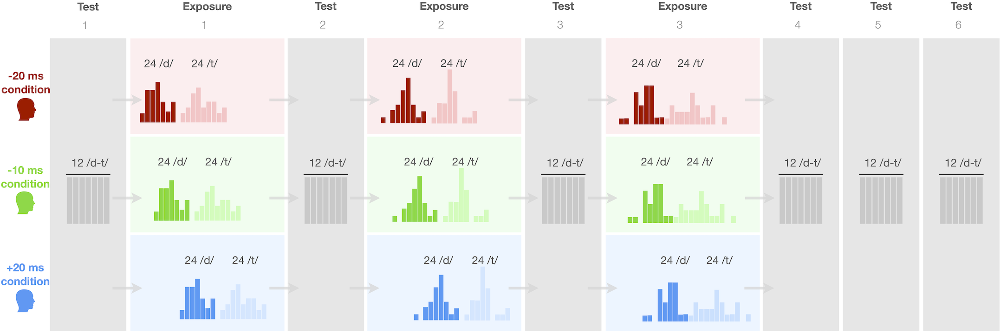

```{r setup, include=FALSE, message=FALSE}
if (!exists("PREAMBLE_LOADED")) source("preamble.R")
```

# Introduction
Human speech perception is a remarkable feat. Successful speech recognition requires that listeners map the acoustic signal onto words and meanings. But this signal-to-meaning mapping varies across talkers and context: the same word spoken by different talkers can sound quite different; and conversely, the same acoustic signal can imply different words depending on the talker. Yet, listeners typically recognize speech quickly and accurately across a wide range of talkers and acoustic conditions (after decades of advances, automatic speech recognition is just beginning to approach the speed and accuracy that most listeners display during everyday speech perception).

Research has identified *adaptivity* as a key component to the robustness of human speech perception. Although first encounters with an unfamiliar accent can cause initial processing difficulty, this difficulty diminishes with exposure, sometimes rapidly [e.g., @bradlow-bent2008; @bradlow2023; @sidaras2009; @xie2021jep]. Eighteen short sentences from a talker with an unfamiliar accent---even a moderately strong second language accent---have been found to significantly improve subsequent perception of that talker's speech [@clarke-garrett2004; @xie2018]. Findings like these suggests that speech perception can be highly malleable, allowing listeners to adjust the mapping from acoustics to phonetic categories and word meanings. While such adaptivity may seem obvious in hindsight, its discovery was a major breakthrough in the field of speech perception, spurring the development of new paradigms and theories [for reviews, see @bent-baeseberk2021; @cummings-theodore2023; @schertz-clare2020; @zheng-samuel2023]. 

We thus know *that* listeners adapt to unfamiliar talkers. What remains unclear, however, is *how* adaptation is achieved. How do listeners integrate information from a new talker, and how does this come to incrementally change their interpretation of that talker's speech? Research on adaptive speech perception tends to discuss informal---often descriptive, rather than explanatory---hypotheses [see also @norris-cutler2021].^[This tendency is hardly specific to speech perception research. Seminal works from the early days of the cognitive sciences describe the field as often phenomenon-driven rather than theory-driven, and insightfully discussed the consequences of this tendency [@newell1974; @platt1964]. Recent reviews have found this trend continued [@yarkoni-westfall2017].] This includes references to "boundary re-tuning/shift", "perceptual/phonetic recalibration/retuning", "category shift/expansion" or similar ideas [e.g., @mcqueen2006; @mitterer2013; @reinisch-holt2014; @schmale2012; @vroomen-baart2009; @xie2017; @zheng-samuel2020]. Such hypotheses do not specify what mechanisms support adaptive speech perception, and make no predictions about how adaptation unfolds incrementally with each new observation from an unfamiliar talker. 

Viewed from this perspective, research on adaptive speech perception can appear to be an open-ended list of empirical questions. Is adaptation more or less immediate, or does it unfold gradually? If the latter, do changes in listeners' behavior accumulate additively, leading to more or less linear changes in behavior? If not a linear development, is adaptation first slow and then fast, or first fast and then slow? And, how do differences in listeners' prior experience affect how listeners adapt? Are there limits to listeners' ability to fully adapt to a new talker? Or can we adapt to more or less any accent provided sufficient input? Etc.

In contrast to informal hypotheses, some existing theories make precise, quantifiable predictions about all of these questions---predictions that remain largely untested. One of the most developed of these theories are *distributional learning* models [e.g., @apfelbaum-mcmurray2015; @harmon2019; @johnson1997; @kleinschmidt-jaeger2015; @magnuson2020; @nearey-assmann2007; @lancia-winter2013; @sohoglu-davis2016]. These models make untested predictions about how adaptation unfolds incrementally during the initial moments of listening to an unfamiliar talker. While distributional learning models differ from each other in important aspects, they share the central assumption that listeners incrementally learn and store information about talkers' speech. This includes information about the phonetic distributions that characterize the talker's speech, such as the average values of phonetic cues, their variability, or even the full phonetic distributions of all speech categories. These statistical properties are then used to interpret subsequent speech from the talker, supporting robust speech recognition across talkers [for reviews, see @bent-baeseberk2021; @schertz-clare2020; @xie2023]. <!-- For example, some of the most parsimonious distributional learning accounts---normalization accounts---assume that listeners adapt their expectations for the phonetic cues the talker produces. Talkers with faster speech rates, for example, might have overall shorter durational cues. Normalization accounts propose that listeners learn, say, the average value that a talker produces for a cue, and interpret subsequent speech from the talker relative to this expectation [@assmann-nearey2007; @mcmurray-jongman2011]. Less parsimonious distributional learning accounts propose that listeners even learn the cue distributions that the talker produces for each category [@johnson1997; @kleinschmidt-jaeger2015]. --> 

With this shared assumption, distributional learning models also share several critical predictions. Listeners' perception is predicted to change incrementally with exposure. The direction and magnitude of that change should gradiently depend on listeners' prior expectations based on relevant previously experienced speech input from other talkers (**prediction 1 - prior expectations**), and both the amount (**prediction 2a - exposure amount**) and distribution of phonetic cues in the exposure input from the unfamiliar talker [**prediction 2b - exposure distribution**, for review, see @xie2023]. Specifically, listeners' categorization functions---the mapping from acoustics to phonetic categories and words---should gradually shift from a starting point that reflects the statistics of previously experienced speech towards a target that reflects the statistics of the new talker's speech. Existing models predict that this shift proceeds until the listener has fully learned the statistics of the new talker's speech (**prediction 3 - learn to convergence**). Finally, some distributional learning models further commit to specific learning mechanisms that constrain how exactly adaptation is expected to accumulate incrementally: both error-driven theories [@harmon2019; @olejarczuk2018; @sohoglu-davis2016] and theories of ideal information integration [@kleinschmidt-jaeger2015; @kleinschmidt2020] predict that adaptation initially proceeds quickly and then slows down as the listener approaches the correct mapping from the acoustic signal to phonetic categories (**prediction 4 - diminishing returns**).^[Predictions (1)-(4) assume that listeners *know* that they are listening to the same new talker. Talker recognition is itself an active inference process that we do not further discuss here [but see @magnuson-nusbaum2007; @kleinschmidt-jaeger2015].] Figure \@ref(fig:predictions) illustrates these predictions and contrasts them with other possible scenarios.

<!-- TO DO: think about whether two-row or three-row figure is better. Currently, the caption describes the latter but perhaps omitting the top row would be better? -->
(ref:predictions) Some hypothetical ways in which adaptive changes in listeners perception might unfold incrementally. The highlighted column in the middle and bottom row illustrates the predictions of models that assume error-based learning or ideal information integration. The rightmost column shows a scenario in which learners adapt but do not reach the correct mapping from the acoustic signal to phonetic categories. **Top:** Using US English word-initial /d/ and /t/ as an example (as in "dip" vs. "tip"), we illustrate a hypothetical scenario of encountering an unfamiliar talker. Transparent lines indicate cross-talker variability in the realization of these two categories along the primary cue used to distinguish them (voice onset timing or VOT). Shown are 20 random talkers from a database of connected speech [@chodroff-wilson2018]. The thicker solid lines indicate a 'typical' talker (averaging over all talkers in the database). Dashed lines indicate a hypothetical unfamiliar talker with a noticeably different distribution of VOT values. <!-- TO DO: single panel in top row. use same colors that you use for categories later --> **Middle:** Illustration of different ways in which listeners' categorization functions along the phonetic VOT continuum might change with increasing exposure to the unfamiliar talker (from more transparent to less transparent). The thicker solid lines indicate the categorization function expected given the phonetic distributions of the typical talker shown in the top row (for details, see SI \@ref(sec:idealized-prior-listeners)). Dashed lines indicate the categorization behavior expected from an idealized learner that has fully learned the unfamiliar talker's distribution of VOT (SI \@ref(sec:idealized-learners)). **Bottom:** The same changes but shown as changes in the point of subjective equality (PSE), the point along the phonetic VOT continuum at which listeners are equally likely to identify a sound as an instance of /d/ or /t/. <!-- TO DO: multiple panels in middle and bottom row: immediate convergence, linear to convergence, gradiently diminishing returns to convergence, plateau prior to convergence. gray categorization functions, solid black learning target, dashes light gray prior; x-axis "phonetic continuum" from 0 to 85 (middle) "Trial" (bottom), y-axis "Probability of responding category A" from 0 to 1 (top) "PSE" (bottom). Make sure to indicate 0, .5, 1 along y in middle row.-->

```{r predictions, fig.height=base.height*3+1/2, fig.width=base.width*4, fig.cap="(ref:predictions)", fig.pos="H"}
d.chodroff_wilson.connected %>%
  filter(Talker %in% sample(unique(Talker), 50)) %>%
  ggplot(aes(x = VOT, color = category)) +
  geom_density(aes(group = interaction(Talker, category)), alpha = .1) +
  annotate("text", x = 75, y = 0.06, label = "PLACEHOLDER", color = "black") +
  scale_color_manual(
    "Category",
    labels = c("/d/", "/t/"),
    values = colours.category_greyscale,
    aesthetics = c("color", "fill"))
```

Although predictions (1)-(4) are specific and testable, they remain largely untested. This is in part due to limitations of the designs and paradigms used in research on adaptive speech perception. The most common paradigms expose one group of listeners to one speech pattern, and a second group of listeners to another speech pattern. Following exposure, both groups are tested on their ability to recognize one of the two speech patterns. Such designs were effective in establishing the *existence* of adaptive speech perception [see also @cummings-theodore2023]. They do, however, offer only weak tests of existing theories [for demonstration, see @xie2023].  Put simply, it is one thing to show that differences in exposure lead to differences in behavior; it is another thing to test whether the direction and magnitude of changes in behavior can be consistently explained by existing theories. 

Recent reviews have thus called for the development of paradigms that can more strongly constrain theories of adaptive speech perception [@bent-baeseberk2021; @schertz-clare2020; @xie2023]. Based on computational simulations, Xie and colleagues argue that strong tests require (a) information about the distribution of phonetic cues in both listeners' prior experience and during exposure, (b) paradigms that measure incremental changes in listeners' behavior both within and across exposure conditions, and (c) analyses that link the latter to the former. 

```{r block-design-figure, fig.height=3, fig.width=5, fig.cap="Incremental exposure-test design of our experiment. The three exposure conditions (rows) differed in the distribution of voice onset time (VOT), the primary phonetic cue to syllable-initial /d/ and /t/ in English (e.g., \"dip\" vs. \"tip\"). Test blocks assessed L1-US English listeners' categorization functions over VOT stimuli that were held identical within and across conditions.", fig.pos="H"}

```

The present study seeks to address this call. We present a novel incremental exposure-test paradigm, and use it to test predictions (1)-(4), repeated in Table \@ref(tab:predictions). Figure \@ref(fig:block-design-figure) illustrates our approach. Between groups of participants, we manipulate the amount and distribution of phonetic cues in the exposure input. <!-- We focus on a phonetic contrast that is known to be subject to adaptive changes in perception [syllable-initial /d/-/t/ in US English, @kleinschmidt2015; @kraljic-samuel2006]. --> The three exposure distributions we use are shifted to different degrees both relative to each other, and relative to listeners' prior expectations, allowing us to test predictions (1) and (2a,b). We measure listeners' categorization functions at multiple points during exposure, and test whether the direction and magnitude of the observed changes in behavior are consistent with the predictions of distributional learning models, including prediction (4) about the diminishing rate of changes in listeners' behavior. To further guide the interpretation of results, we use normative models of adaptive speech perception [ideal observers and adaptors, @feldman2009; @kleinschmidt-jaeger2015; @massaro1989; @xie2023]. This enables predictions about---intentionally idealized---listeners and distributional learners, prior to considerations about memory or other cognitive limitations. Comparisons of participants' categorization functions against these normative models provides a principled and informative approach to identifying constraints on adaptive speech perception, addressing prediction (3) about learning to convergence.

\begin{table}[!ht]
\begin{small}
\begin{tabular}{p{0.4\textwidth}p{0.55\textwidth}}
\hline
Prediction 1 ({\bf prior expectations}) & AA, \cite{kang-schertz2021, schertz2016, tan2021, xie2021cognition} \\

Prediction 2a ({\bf exposure amount})  & LGPL/VGPL, \cite{cummings-theodore2023, kleinschmidt-jaeger2012, liu-jaeger2018, vroomen2007} \\

Prediction 2b ({\bf exposure distribution}) & AA, \cite{hitczenko-feldman2016, xie2021cognition, tan2021}; DL, \cite{clayards2008, chladkova2017, colby2018, idemaru-holt2011, kleinschmidt-jaeger2016, theodore-monto2019} \\

Prediction 3 ({\bf learn to convergence})  & \\

Prediction 4 ({\bf diminishing returns}) & \\

\hline
\end{tabular}
\caption{Predictions of distributional learning models about incremental adaptation to an unfamiliar talker. Also listed are examples of previous work that provide some initial, almost always qualitative, evidence for these predictions (AA = adaptation to natural accents; DL = distributional learning; LGPL/VGPL = lexically- or visually-guided perceptual learning). To the best of our knowledge, prediction (2a) is the only that has been tested against {\em incremental} changes in listeners' behavior.}
\label{tab:predictions}
\end{small}
\end{table}

<!-- Prediction 1 ({\bf prior expectations}) & Listeners' categorization function prior to informative exposure to an unfamiliar talker's speech is determined by the statistics of the speech input they have previously experienced from other talkers. & AA, \cite{kang-schertz2021, schertz2016, tan2021, xie2021cognition} \\ -->

<!-- Prediction 2a ({\bf exposure amount}) & \multirow{2}{.6\textwidth}{With increasing exposure to the new talker, listeners' adapt their prior expectations by integrating information about the talker's phonetic distributions. The direction and magnitude of changes in listeners' categorization function relative to their pre-exposure behavior are determined by the amount and distribution of phonetic cues relative the statistics of previously experienced speech input}. & LGPL/VGPL, \cite{cummings-theodore2023, kleinschmidt-jaeger2012, liu-jaeger2018, vroomen2007} \\ -->

<!-- Prediction 2b ({\bf exposure distribution}) & & AA, \cite{xie2021cognition, tan2021}; DL, \cite{clayards2008, chladkova2017, colby2018, idemaru-holt2011, kleinschmidt-jaeger2016, theodore-monto2019} \\ -->

<!-- Prediction 3 ({\bf learn to convergence}) &  With additional exposure, listeners will continue to adapt until they have fully learned the exposure distribution. & \\ -->

<!-- Prediction 4 ({\bf diminishing returns}) & With each new observation, changes in listeners' behavior depend on the prediction error (or equivalently, the amount of new information) associated with that observation. As a consequence, listeners' behavior should initially change quickly and then less and less as listeners converge against the exposure distribution. & LGPL \cite{liu-jaeger2018} \\ -->

Our paradigm integrates, and builds on, advances in separate lines of research on unsupervised distributional learning during speech perception [@clayards2008; @colby2018; @kleinschmidt2020; @theodore-monto2019], lexically- or visually-guided perceptual learning [@cummings-theodore2023; @kleinschmidt-jaeger2012; @vroomen2007], and adaptation to natural accents [@hitczenko-feldman2016; @tan2021; @xie2021cognition]. In the general discussion, we elaborate on these and related works in more detail. For now, we note the most important limitations of existing paradigms that motivate our approach. 

First, research on adaptation to natural accents does not typically investigate how the phonetic properties of the exposure input relate to changes in listeners' behavior. Even notable exception to this trend tend to be limited to broad qualitative comparisons [e.g., @schertz2016; @xie2017; see also, @schertz-clare2020], leaving open whether the direction and magnitude of changes in listeners' behavior can be predicted by existing models [but see @hitczenko-feldman2016; @tan2021; @xie2021cognition]. This limitation is shared with research on lexically- or visually-guided perceptual learning. Explicit tests of distributional learning models have thus been largely limited to distributional learning paradigms [e.g., @chladkova2017; @clayards2008; @colby2018; @idemaru-holt2011; @kleinschmidt2020; @theodore-monto2019]. 

Second, the small number of studies that *has* tested predictions of existing models has focused on the *outcome* of learning, leaving open whether adaptive speech perception unfolds over time in ways consistent with distributional learning models. For example, in an important early study, @clayards2008 exposed two different groups of US English listeners to instances of "b" and "p" that differed in their distribution along the voice onset time continuum (VOT). VOT is the primary phonetic cue to word-initial stops in US English: the voiced category (e.g. /b/) is produced with lower VOT than the voiceless category (e.g., /p/). Clayards and colleagues held the VOT means of /b/ and /p/ constant between the two exposure groups, but manipulated whether both /b/ and /p/ had wide or narrow variance along VOT. Using a distributional learning model similar to the idealized learners we presented below, Clayards and colleagues predicted that listeners in the wide variance group would exhibit a more shallow categorization function than the narrow variance group. This is precisely what they found, providing support for prediction (2b) that the distribution of phonetic cues in the exposure input causes changes in listeners' behavior [see also @nixon2016; @theodore-monto2019]. Together with more recent findings from adaptation to natural accents [@hitczenko-feldman2016; @tan2021; @xie2021cognition], these findings suggests that the outcome of adaptation is qualitatively compatible with predictions (2a) and (2b) of distributional learning models.^[A related line of work has used distributional learning and training paradigms to study the acquisition of *novel* sound contrasts [e.g., @maye2002; @mcclelland1999; @pajak-levy2012; @pisoni1982]. These studies, too, have observed learning behavior qualitatively compatible with distributional learning models [for review, see @pajak2016]. Here, we instead focus on adaptation to shifts along *known* phonetic continua---i.e., the type of input that is generally believed to be the easiest to adapt to.] Previous studies have, however, relied on tests that averaged over, and/or followed, hundreds of exposure trials. This leaves open whether listeners’ categorization behavior follows the change pattern predicted by models of adaptive speech perception: where categorization first reflects expectations based on previously experienced phonetic distributions (prediction 1) and with increasing exposure, integrates the phonetic distributions of the input from the unfamiliar talker (predictions 2a, b). Previous studies also focused on one prediction at a time, leaving open how the effect of prior expectations and the statistics of the unfamiliar input *jointly* explain adaptation. 

Third and finally, we are not aware of *any* previous attempts to address predictions (3 - learn to convergence) and (4 - diminish returns): without incremental testing it is difficult to assess whether there are hard limits on adaptation or simply 'how far the learner has gotten' with the exposure input they have received so far [for discussion, see @cummings-theodore2023; @kleinschmidt-jaeger2016; @kleinschmidt2020]. For the same reasons, it is difficult to assess whether the build-up of adaptation follows the predictions of error-based learning or ideal information integration (prediction 4). 

The incremental exposure-test paradigm in Figure \@ref(fig:block-design-figure) begins to address these knowledge gaps. In addition to our primary goals, we took several modest steps towards addressing concerns about ecological validity that might limit the generalizability of DL results. This includes concerns about the ecological validity of both the stimuli and their distribution in the experiment [see discussion in @baese-berk2018]. For example, previous distributional learning studies have often used highly unnatural, 'robotic'-sounding, speech. Beyond raising questions about what types of expectations listeners apply to such speech, these stimuli also failed to exhibit naturally occurring covariation between phonetic cues that listeners are known to expect [see, e.g., @idemaru-holt2011; @schertz2016]. Similarly, LGPL/VGPL studies have often used perceptually ambiguous stimuli obtained by 'acoustic blending'---mixing recordings of two words (e.g., "sin" and "shin") at different relative intensity. This, too, can create acoustic properties that are rarely, if ever, observed in human speech (Rachel Theodore, p.c.). We instead developed stimuli that both sound natural and exhibit the type of phonetic covariation that listeners expect from everyday speech perception. We return to these and additional steps we took to increase the ecological validity of the phonetic *distributions* under Methods.

To anticipate our results, we find that the changes in listeners' categorization behaviors *largely* follow the predictions of distributional learning models. In particular, we present the first evidence that the direction and magnitude of changes in listeners' categorization functions is jointly determined by their prior expectations (predictions 1) and the amount and distribution of phonetic cues in the exposure input (predictions 2a,b). We also find some---though not decisive---evidence that changes in rate of adaptation across exposure are consistent with the predictions of error-driven learning theories and theories of ideal information integration (prediction 4). We show that a Bayesian model of adaptation that is based on principles of ideal information integration [the ideal adaptor, @kleinschmidt-jaeger2015; @kleinschmidt-jaeger2016] predicts participants' responses with very high accuracy ($R^2 = 97%$). However, not all observations we make are predicted by existing models. In particular, we find little support for prediction (3 - learn to convergence). Rather, we find suggestive evidence for a previously unrecognized constraint on adaptive speech perception: changes in listeners' behavior seem to plateau long before listeners achieve the categorization functions and accuracy that would be expected if they fully learned the talkers' phonetic distributions. We further find that this constraint on adaptation seems to be asymmetric, depending on the direction of the shift in the exposure input relative to listeners' prior expectations. We discuss the implications of our findings for theories of adaptive speech perception, and suggest how future variants of our paradigm can be used to further contrast different models of adaptive speech perception. 

## Open science
All data and code for this article can be downloaded from [https://osf.io/hxcy4/](OSF). Following @xie2023, both this article and its supplementary information (SI) are written in R Markdown. This allows other researchers to replicate and validate our analyses with the press of a button using freely available software [R, @R; @RStudio, see also SI, \@ref(sec:software)]. 

This study was not publicly pre-registered. The design, participant recruitment, and procedure were internally pre-registered as part of an annual undergraduate class at the University of Rochester (BCS206/207), in which students replicate and extend previous work in the cognitive sciences. The ideal observer and adaptor models introduced below to guide interpretation of results follow our previous work [@kleinschmidt-jaeger2015; @tan2021; @xie2023]. However, the choice of phonetic data on which these models are trained constitute researcher degrees of freedom. Where relevant, we motivate our decisions.


