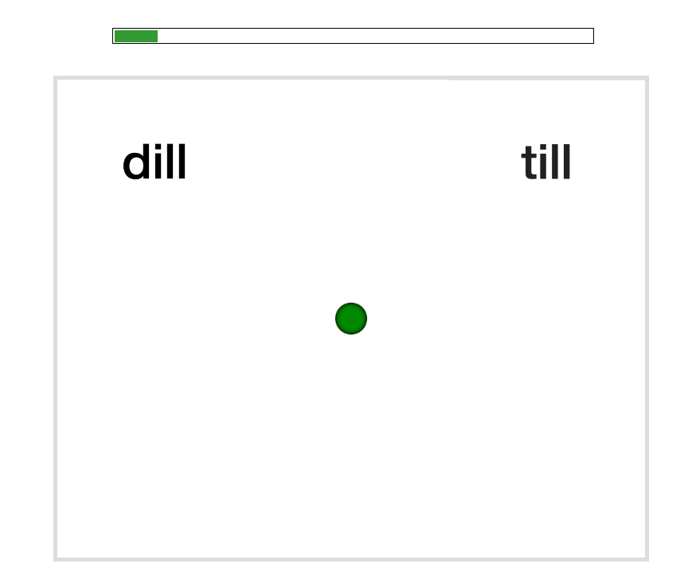

```{r, include=FALSE, message=FALSE}
if (!exists("PREAMBLE_LOADED")) source("preamble.R")
```

# Experiment

```{r load data}
d <- 
  read_csv("../data/experiment-results.csv", show_col_types = F) %>%
  # load f0 measurements of stimuli
  left_join(
    read_csv("../data/AEDLVOT_stimuli_f0_5ms.csv", show_col_types = F) %>%
      dplyr::select(filename, VOT, f0_5ms_into_vowel, vowel_duration) %>%
      rename(
        Item.VOT = VOT,
        # This is the F0 measured in the same way as Chodroff & Wilson (2018)
        # (i.e., 5ms into the vowel)
        Item.Measured_f0 = f0_5ms_into_vowel,
        Item.Filename = filename) %>%
      mutate(Item.Filename = paste0(Item.Filename, ".wav")),
    by = c("Item.Filename", "Item.VOT")) %>%
  mutate(
    Response.Voiceless = ifelse(Response.Voicing == "voiceless", 1, 0),
    across(
      c(Experiment, starts_with("List"), 
        ParticipantID, Participant.Race, Participant.Ethnicity, Participant.Sex,
        Condition.Exposure, Phase, 
        Trial.ImageSelection, Item.ExpectedResponse, Item.ExpectedResponse.Voicing, Item.MinimalPair,
        Response.ClickPosition, Response.Voicing),
      factor),
    Participant.Sex = str_to_lower(Participant.Sex),
    Item.f0_Mel = normMel(Item.F0_target_for_generation_script)) 
```

## Methods 
### Participants
We recruited `r nlevels(d$ParticipantID) + 4` participants from the Prolific crowdsourcing platform. We used Prolific's pre-screening to limit the experiment to participants (1) of US nationality, (2) who reported to be English speaking monolinguals, and (3) had not previously participated in any experiment from our lab on Prolific. Prior to the start of the experiment, participants had to confirm that they (4) had spent the first 10 years of their life in the US, (5) were in a quiet place and free from distractions, and (6) wore in-ear or over-the-ears headphones that cost at least \$15. An additional 115 participants loaded the experiment but did not start or complete it.^[Unlike in lab-based experiments, for which participants' right to stop the experiment at any point is costly (both in terms of physical effort and perceived social cost), exercising this right in web-based experiments is essentially cost free---in particular, if exercised early in the experiment.] 

Participants took an average of 31.6 minutes to complete the experiment (SD = 20 minutes) and were remunerated \$8.00/hour. An optional post-experiment survey recorded participant demographics using NIH prescribed categories, including participant sex (`r d.Participant <- (d %>% distinct(ParticipantID, Participant.Age, Participant.Sex, Participant.Ethnicity, Participant.Race, Participant.Raceother)); d.Participant %>% group_by(Participant.Sex) %>% tally() %>% mutate(x = paste(n, Participant.Sex, sep = " = ", collapse = ", ")) %>% pull(x) %>% first()`), age (mean = `r mean(d.Participant$Participant.Age, 1)` years; 95% quantiles = `r paste(quantile(d.Participant$Participant.Age, c(.025, .975), na.rm = T), collapse = "-")` years), race (`r d.Participant %>% group_by(Participant.Race) %>% tally() %>% mutate(x = paste(n, Participant.Race, sep = " = ", collapse = ", ")) %>% pull(x) %>% first()`), and ethnicity (`r d.Participant %>% group_by(Participant.Ethnicity) %>% tally() %>% mutate(x = paste(n, Participant.Ethnicity, sep = " = ", collapse = ", ")) %>% pull(x) %>% first()`). 

Participants' responses were collected via Javascript developed by the Human Language Processing Lab at the University of Rochester [@JSEXP] and stored via Proliferate developed at, and hosted by, the ALPs lab at Stanford University [@Proliferate].

### Materials 
We recorded 8 tokens each of four minimal word pairs (*dill/till*, *dim/tim*, *din/tin*, and *dip/tip*) from a 23-year-old, female L1-US English talker from New Hampshire, judged to have a "general American" accent. In addition to these critical minimal pairs we also recorded three words that did not did not contain any stop consonant sounds ("flare", "share", and "rare"). These word recordings were used for catch trials. Stimulus intensity was normalized to 70 dB sound pressure level for all recordings. 

The critical minimal pair recordings were used to create four VOT continua using a script [@winn2020] in Praat [@boersma2022]. This approach resulted in continuum steps that sound natural [unlike the highly robotic-sounding stimuli employed in @clayards2008; @kleinschmidt-jaeger2016]. A post-experiment survey asked participants: "*Did you notice anything in particular about how the speaker pronounced the different words (e.g. till, dill, etc.)?*" No participant reported that the stimuli sounded unnatural. The procedure also maintained the natural correlations between the most important cues to word-initial stop-voicing in L1-US English (VOT, F0, and vowel duration). Specifically, the F0 at vowel onset of each stimulus was set to respect the linear relation with VOT observed in the original recordings of the talker. The duration of the vowel was set to follow the natural trade-off relation with VOT [@allen-miller1999]. Further details on the recording and resynthesis procedure are provided in the supplementary information (SI, \@ref(sec:stimulus-generation)). <!-- TO DO: integrate point about lapse rates being low from the start -->

The VOTs generated for each continuum ranged from -100 to +130 ms in 5 ms steps.^[We follow previous work [@kleinschmidt2020; @lisker-abramson1964] and refer to pre-voicing as negative VOTs though we note that pre-voicing is perhaps better conceived of as a separate phonetic feature [for discussion, see @REF]. Estimates of the proportion of voiced stops produced with pre-voicing in L1-US English vary substantially between studies (between 20% and 57%) [e.g. @lisker-abramson1967; @smith1978; @westbury1979; @dmitrieva2015]. Because pre-voicing is not regarded as a phonemic determinant of English, some studies either discard such data or ignore them altogether (e.g. @zue1976; @klatt1975; @chodroff-wilson2017). In some studies that do report pre-voicing, the majority of the tokens were attributed to a minority of talkers [e.g. @lisker-abramson1967; @flege1982].  Although speakers tend to prefer one type of production over the other they do not typically use one type exclusively [@docherty2011].] A norming experiment (N = 24 participants) reported in the SI (\@ref(sec:norming-experiment)) was used to select the three minimal pair continua that elicited the most similar categorization responses (*dill-till*, *din-tin*, and *dip-tip*). These three continua were used to create the exposure conditions shown in Figure \@ref(fig:block-design-figure).

### Procedure
At the start of the experiment, participants acknowledged that they met all requirements and provided consent, as per the Research Subjects Review Board of the University of Rochester. Participants also had to pass a headphone test [@woods2017], and were instructed to not change the volume throughout the experiment. Following instructions, participants completed 234 two-alternative forced-choice categorization trials (Figure \@ref(fig:example-trial)). Participants were instructed that they would hear a female talker say a single word on each trial, and were asked to select which word they heard. Participants were asked to listen carefully and answer as quickly and as accurately as possible. They were also alerted to the fact that the recordings were subtly different and therefore may sound repetitive. 

```{r example-trial, fig.cap="Example trial display. When the green button turned bright green, participants had to click on it to play the recording.", out.width="33%"}

```

Unbeknownst to participants, the 234 trials were split into exposure (54 trials each) and test blocks (12 trials each). Participants were given the opportunity to take breaks after every 60 trials, which was always during an exposure block. Finally, participants completed an exit survey and an optional demographics survey.

*Test blocks. * The experiment started with a test block. Test blocks were identical within and across conditions, always including 12 minimal pair trials assessing participants' categorization at 12 different VOTs (-5, 5, 15, 25, 30, 35, 40, 45, 50, 55, 65, 70 ms). Test blocks were designed to be short for three reasons.<!-- TO DO: make link more apparent back to anticipated challenges of repeated testing mentioned in intro --> First, listeners' attention span is limited. Second, previous work has found that repeated testing over uniform test continua can reduce or undo the effects of informative exposure [@liu-jaeger2018; @liu-jaeger2019; @cummings-theodore2023].<!-- TO DO: Maryann, I don't think the 2023 paper shows that, right? is it the 2022 paper or an even more recent one by Shawn? --> Third, holding the distribution of test stimuli constant across exposure condition inevitably means that the relative unexpectedness of these test stimuli differs between the exposure conditions. By keeping tests short relative exposure, we aimed to minimize the influence of test trials on adaptation while still being able to estimate changes in listeners categorization function. 

A uniform distribution over VOTs was chosen to maximize the statistical power to determine participants' categorization function. The assignment of VOTs to minimal pair continua was randomized for each participant, while counter-balancing it within and across test blocks. Each minimal pair appear equally often within each test block (four times), and each minimal pair appear with each VOT equally often (twice) across all six test blocks (and no more than once per test block). 

Each trial started with a dark-shaded green fixation dot being displayed. At 500ms from trial onset, two minimal pair words appeared on the screen, as shown in Figure \@ref(fig:example-trial). At 1000ms from trial onset, the fixation dot would turn bright green and participants had to click on the dot to play the recording. This was meant to reduce trial-to-trial correlations by resetting the mouse pointer to the center of the screen at the start of each trial. Participants responded by clicking on the word they heard and the next trial would begin. 

*Exposure blocks. * Each exposure block consisted of 24 /d/ and 24 /t/ trials, as well as 6 catch trials that served as a check on participant attention throughout the experiment (2 instances for each of three combinations of the three catch recordings). With a total of 144 trials, exposure was substantially shorter than in similar previous experiments [cf. 228 trials in @clayards2008; 222 trials in @kleinschmidt2020; 2 x 236 trials, @theodore-monto2019; 456 trials, @nixon2016]. 

The distribution of VOTs across the 48 /d/-/t/ trials depended on the exposure condition. Specifically, we first created a *baseline* condition. Although not critical to the purpose of the experiment, we aimed for the VOT distribution in this condition to closely resemble participants' prior expectations for a 'typical' female talker of L1-US English (for details, see SI, \@ref(XXX)). The mean and standard deviations for /d/ along VOT were set at 5 ms and `r (80)^.5` ms, respectively. The mean and standard deviations for /t/ were set at 50 ms and `r (270)^.5` ms, respectively. To create more realistic VOT distributions, we *sampled* from the intended VOT distribution (top row of Figure \@ref(fig:exp2-design-distribution)). This creates distributions that more closely resemble the type of distributional input listeners experience in everyday speech perception, deviating from previous work, which exposed listeners to highly unnatural fully symmetric samples [@clayards2008; @kleinschmidt-jaeger2016; @kleinschmidt2020]. 

Half of the /d/ and half of the /t/ trials were labeled, the other half was unlabeled. Earlier distributional learning studies have mostly used fully unlabeled exposure [@bejjanki2011; @clayards2008; @nixon]. <!-- TO DO: check --> This contrasts with visually- or lexically-guided perceptual learning studies, which use labeled exposure [@bertelson2003; @norris2003; @kraljic-samuel2005; @vroomen2007]. Such labeling is known to facilitate adaptation [@burchill2018; @burchill2023; but see @kleinschmidt2015]---indeed, if shifted pronunciations are embedded in minimal pair or nonce-word context, listeners do no longer shift their categorization boundary [@norris2003; @REF-theodore?; @babel?]. While lexical contexts often disambiguate sounds in everyday speech, that is not *always* the case: especially, when confronted with unfamiliar accents, listeners often have uncertainty about the word they are hearing, and must either use contextual information to label the input or adapt from unlabeled input. Here, we thus aimed to strike a compromise between always and never labeling the input [paralleling one of the conditions in @kleinschmidt2015].

Unlabeled trials were identical to test trials except that the distribution of VOTs across those trials was bimodal (rather than uniform), and determined by the exposure condition.^[Previous studies have estimated changes in participants' categorization responses by analyzing responses on unlabeled exposure trials [e.g., @clayards2008; @kleinschmidt-jaeger2016; @theodore-monto2019]. This approach compares responses across different values of acoustic-phonetic cues (since the exposure inputs differed by exposure condition), so that assumptions baked into the analysis approach (e.g., linearity along the acoustic-phonetic continuum) can potentially bias the results. Here we avoid this issue by holding test stimuli constant [see also @kleinschmidt2020, Experiment 4].] Labeled trials instead presented two response options with identical stop onsets (e.g., *din* and *dill*). This effectively labeled the input as belonging to the intended category (e.g., /d/).

Next, we created the two additional exposure conditions by shifting these VOT distributions by +10 or +40 ms (see Figure \@ref(fig:exp2-design-distribution)). This approach exposes participants to heterogeneous approximations of normally distributed VOTs for /d/ and /t/ that varied across blocks, while holding all aspects of the input constant across conditions except for the shift in VOT. The order of trials was randomized within each block and participant, with the constraint that no more than two catch trials would occur in a row. Participants were randomly assigned to one of 3 (exposure condition) x 3 (block order) x 2 (placement of response options) lists. 

(ref:exp2-design-distribution) Histogram of voice onset times (VOTs) for each of the three exposure blocks A-C by trial type (/d/ or /t/, labeled or unlabeled) and exposure condition (baseline vs. +10 vs. +40). Each exposure block contained 12 labeled /d/, 12 labeled /t/, 12 unlabeled /d/, and 12 unlabeled /t/ trials, as well as 6 catch trials (not shown). Except for the shift in VOTs (+0, 10 or 40 ms VOT to each trial), the VOT distribution of these trials was identical across exposure conditions. The order of exposure blocks A-C was counter-balanced across participants using a Latin-square design.

```{r exp2-design-distribution, fig.height=base.height*3+1/2, fig.width=base.width*4, fig.cap="(ref:exp2-design-distribution)", warning=FALSE, message=FALSE}
d.exposure_blocks <- 
  read_csv("../data/exposure_conditions_lists.csv", show_col_types = F) %>% 
  mutate(
    condition = factor(case_when(condition == "Shift0" ~ "baseline",
                          condition == "Shift10" ~ "+10ms",
                          condition == "Shift40" ~ "+40ms")),
    condition = fct_relevel(condition, c("baseline", "+10ms", "+40ms")),
    labelling = as_factor(labelling))

# set variances of categories
var_d <- 80
var_t <- 270

d.means <- 
  crossing(
    condition = c("baseline", "+10ms", "+40ms"),
    category = c("/d/", "/t/")) %>% 
  mutate(
    block = "Block A", 
    condition = fct_relevel(condition, c("baseline", "+10ms", "+40ms")),
    mu = c(15, 60, 45, 90, 5, 50),
    sigma = c(80, 270, 80, 270, 80, 270)^.5, 
    mu_label = map2(category, mu, ~ bquote(mu[.(.x)]==.(.y))),
    sigma_label = map2(category, sigma, ~ bquote(sigma[.(.x)]==.(round(.y, 1)))),
    label = map2(mu_label, sigma_label, ~ comb_plotmath(.x, ", ", .y)))

p.histogram_conditions <- 
  d.exposure_blocks %>% 
  na.omit() %>% 
  filter(image_selection == "forward" & list_LSQ_variant == "A") %>%
    mutate(block = case_when(
    block == 2 ~ "Block A",
    block == 4 ~ "Block B",
    block == 6 ~ "Block C")) %>% bind_rows(
      d.exposure_blocks %>% na.omit() %>% filter(image_selection == "forward" & list_LSQ_variant == "A") %>% mutate(block = "Block D")) %>%
  mutate(block = fct_relevel(block, c("Block A", "Block B", "Block C", "Block D"))) %>% 
  ggplot() +
  geom_histogram(
    aes(x = VOT, 
        fill = paste(condition, category, labelling), 
        color = paste(condition, category, labelling),
        linetype = labelling), 
    alpha = .8) +
  scale_colour_manual(
    "Labelling",
    values = c(
      "baseline /d/ labeled" = "#800000", 
      "baseline /d/ unlabeled" = "#ff9999",
      "baseline /t/ labeled" = "#cc0000", 
      "baseline /t/ unlabeled" = "#ffe6e6",
      "+10ms /d/ labeled" = "#0a751c",
      "+10ms /d/ unlabeled" = "#b9f9c3",
      "+10ms /t/ labeled" = "#12D432",
      "+10ms /t/ unlabeled" = "#e8fdeb",
      "+40ms /d/ labeled" = "#02427e", 
      "+40ms /d/ unlabeled" = "#b4dafe",
      "+40ms /t/ labeled" = "#0481F3", 
      "+40ms /t/ unlabeled" = "#e6f3ff"),
    aesthetics = c("color", "category", "fill"),
    labels = c("/d/ labeled", "/d/ unlabeled", "/t/ labeled", "/t/ unlabeled", "", "", "", "", "", "", "", "")) +
  guides(
    colour = guide_legend(
      override.aes = list(
        colour = c("#383838", "#C0C0C0", "#606060", "#F0F0F0", 0, 0, 0, 0, 0, 0, 0, 0),
        fill = c("#383838", "#C0C0C0", "#606060", "#F0F0F0", 0, 0, 0, 0, 0, 0, 0, 0),
        linetype = c(2, 1, 2, 1, 0, 0, 0, 0, 0, 0, 0, 0),
        values = c("/d/ labeled", "/d/ unlabeled", "/t/ labeled", "/t/ unlabeled", 0, 0, 0, 0, 0, 0, 0, 0)), nrow = 2)) +
  scale_x_continuous("VOT (ms)", breaks = seq(-50, 150, 50)) +
  scale_y_continuous("Count") +
  geom_text(
    data = d.means,
    aes(x = -10,  y = 17, 
        label = label),
    parse = T,
    size = 2, hjust = 0, position = position_dodge2v(height = -8),
    inherit.aes = F) +
  facet_grid(
    condition ~ block, 
    labeller = labeller(block = c("Block A" = "Block A", "Block B" = "Block B", "Block C" = "Block C", "Block D" = "all")), # facet_grid not respecting factor order when block values include "all" 
    scales = "free_y") +
  guides(linetype = "none") +
  theme(legend.position = "top",
        legend.title.align = 0,
        legend.text.align = 0,
        legend.justification = c(.5, .5),
        legend.box.just = "center",
        legend.key.width = unit(12, "pt"),
        legend.key.height = unit(12, "pt"),
        legend.box.spacing = unit(1, "pt"), 
        panel.grid.major.x = element_blank(),
        panel.grid.minor.x = element_blank())
p.histogram_conditions
```

### Exclusions

```{r get-exclusion-indicators, warning=FALSE}
# mark catch trials rows and mark those to be excluded
d %<>% 
  mutate(
    Is.CatchTrial = ifelse(Item.ExpectedResponse %in% c("flare", "rare", "share"), TRUE, FALSE),
    CatchTrial.Correct = ifelse(
      Is.CatchTrial == TRUE, 
      ifelse(Item.ExpectedResponse == Response, TRUE, FALSE), NA),
    Answer.sex.Correct = ifelse(sex == "woman", TRUE, FALSE)) %>% 
  group_by(ParticipantID) %>% 
  mutate(Exclude_participant.due_to_catch_trials = ifelse(sum(CatchTrial.Correct, na.rm = TRUE) < 17, TRUE, FALSE)) %>%
  ungroup()

# mark labelled trials
d %<>% 
  mutate(
    Response.Correct = ifelse(Item.ExpectedResponse == Response, TRUE, FALSE),
    LabeledTrial.Correct = ifelse(Item.Labeled == TRUE, ifelse(Response.Correct == TRUE, TRUE, FALSE), NA)) %>% 
  group_by(ParticipantID) %>% 
  mutate(Exclude_participant.due_to_labeled_trials = ifelse(sum(LabeledTrial.Correct, na.rm = T) < 68, TRUE, FALSE))

# get data for exclusion due to categorization slope of first 36 trials. 
# set the range of VOT values 
empirical_means <- c(17, 62)
VOT_for_required_proportion_t <- empirical_means + c(-20, 20)
required_proportion_t <- c(.15, .80) 

d.VOT_exclusion <- 
  d %>% 
  filter(Block == 1 | (Block == 2 & Trial %in% c(13:36))) %>% 
  drop_na(c(ParticipantID, Response.Voicing, Item.VOT)) %>% 
  mutate(Response.ProportionVoiceless = ifelse(Response.Voicing == "voiceless", 1, 0)) %>%
  select(c(Experiment, ParticipantID, Condition.Exposure, Response.Voicing, Response.ProportionVoiceless, Item.VOT)) %>%
  # Fit logistic regression by participant to get model predictions 
  group_by(ParticipantID, Experiment, Condition.Exposure) %>%
  nest() %>%
  mutate(
    CategorizationModel =
      map(
        data, 
        ~ glm(
          Response.ProportionVoiceless ~ 1 + Item.VOT, 
          data = .x, 
          family = binomial))) %>% 
  # type = "response" in predict() gives the probability
  summarise(
    Model.predicted.Reponse = 
      map(
        CategorizationModel, 
        ~ predict(
          object = .x, 
          newdata = tibble(Item.VOT = VOT_for_required_proportion_t), 
          type = "response"))) %>% 
  mutate(
    Exclude_participant.due_to_VOT_slope = 
      map(
        Model.predicted.Reponse, 
        ~ ifelse(.x[1] > required_proportion_t[1] || .x[2] < required_proportion_t[2], TRUE, FALSE)),
    Exclude_participant.due_to_lower_VOT = 
      map(
        Model.predicted.Reponse, 
        ~ ifelse(.x[1] > required_proportion_t[1], TRUE, FALSE)),
    Exclude_participant.due_to_higher_VOT = 
      map(
        Model.predicted.Reponse, 
        ~ ifelse(.x[2] < required_proportion_t[2], TRUE, FALSE))) %>% 
  select(ParticipantID, Experiment, Condition.Exposure, Exclude_participant.due_to_VOT_slope, Exclude_participant.due_to_lower_VOT, Exclude_participant.due_to_higher_VOT) %>% 
  mutate(across(c(Exclude_participant.due_to_VOT_slope, Exclude_participant.due_to_lower_VOT, Exclude_participant.due_to_higher_VOT), unlist)) %>% 
  ungroup()

d %<>% left_join(d.VOT_exclusion)
```

```{r set-RT-exclusion-criteria}
# get exclusions due to RT
excl.RT <- 
  d %>%
  filter(
    Is.CatchTrial == FALSE,
    Exclude_participant.due_to_catch_trials == FALSE,
    Exclude_participant.due_to_labeled_trials == FALSE,
    Exclude_participant.due_to_VOT_slope == FALSE) %>% 
  group_by(ParticipantID) %>%
  mutate(
    Response.log_RT = log10(ifelse(Response.RT <= 0, NA_real_, Response.RT)),
    Response.log_RT.scaled = scale(Response.log_RT), 
    Response.log_RT.mean = mean(Response.log_RT, na.rm = T)) %>% 
  ungroup() %>% 
  mutate(Exclude_participant.due_to_RT = ifelse(abs(scale(Response.log_RT.mean)) > 3, TRUE, FALSE)) %>% 
  filter(Exclude_participant.due_to_RT == TRUE) %>% 
  distinct(ParticipantID) %>% 
  nrow()
```


```{r make-data-for-analysis}
d_for_analysis <- 
  d %>%
  filter(
    Is.CatchTrial == FALSE &
    Exclude_participant.due_to_catch_trials == FALSE &
    Exclude_participant.due_to_labeled_trials == FALSE &
    Exclude_participant.due_to_VOT_slope == FALSE) %>% 
  group_by(Block) %>%
      mutate(
        Block.plot_label = factor(case_when(
          Block == 1 ~ "Test 1",
          Block == 3 ~ "Test 2",
          Block == 5 ~ "Test 3",
          Block == 7 ~ "Test 4",
          Block == 8 ~ "Test 5",
          Block == 9 ~ "Test 6",
          Block == 2 ~ "Exposure 1",
          Block == 4 ~ "Exposure 2",
          Block == 6 ~ "Exposure 3")),
        Block.plot_label = fct_relevel(Block.plot_label, c("Test 1", "Exposure 1", "Test 2", "Exposure 2", "Test 3", "Exposure 3",  "Test 4", "Test 5", "Test 6")))
```

Due to data transfer errors 4 participants' data were not stored and therefore excluded from analysis. We further excluded from analysis participants who committed more than 3 errors out of the 18 catch trials (<83% accuracy, N = `r d %>% filter(Exclude_participant.due_to_catch_trials == TRUE) %>% group_by(ParticipantID) %>% summarise() %>% tally() %>% pull(n)`), participants who committed more than 4 errors out of the 72 labelled trials (<94% accuracy, N = `r d %>% filter(Exclude_participant.due_to_labeled_trials == TRUE) %>% group_by(ParticipantID) %>% summarise() %>% tally() %>% pull(n)`), participants with an average reaction time more than three standard deviations from the mean of the by-participant means (N = `r excl.RT`),  participants who had atypical categorization functions at the start of the experiment (N = `r d %>% filter(Exclude_participant.due_to_VOT_slope == TRUE) %>% group_by(ParticipantID) %>% summarise() %>% tally() %>% pull(n)`, see SI, \@ref(XXX) for details), and participants who reported not to have used headphones (N = `r d %>% group_by(ParticipantID, audio_type) %>% summarise() %>% filter(!(audio_type %in% c("in-ear", "over-ear"))) %>% nrow()`). This left for analysis `r nrow(d_for_analysis %>% filter(Phase == "exposure"))` exposure and `r nrow(d_for_analysis %>% filter(Phase == "test"))` test observations from `r nrow(d_for_analysis %>% ungroup() %>% distinct(ParticipantID))` participants (94% of total), evenly split across the three exposure conditions.


```{r remove-unused-objects-section2}
rm(
  d,
  d.exposure_blocks,
  d.VOT_exclusion,
  d.means,
  p.histogram_conditions
)
```


