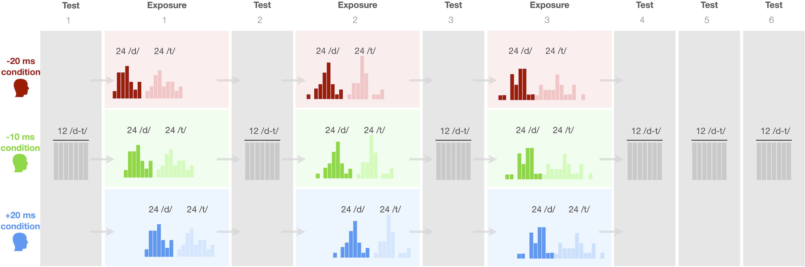

```{r, include=FALSE, message=FALSE}
if (!exists("PREAMBLE_LOADED")) source("preamble.R")
```

# Methods
The contributions summarized above are made possible by a combination of methodological advances. We combine (i) an incremental exposure-test distributional learning paradigm with (ii) incremental Bayesian mixed-effects psychometric models, and (iii) model-guided interpretation. Together, (i)-(iii) thus allow us to put the predictions in Table \@ref(tab:predictions) to a much stronger quantitative test than in previous work. Our design is shown in Figure \@ref(fig:block-design-figure). Between groups of participants, we manipulate the distributions of phonetic cues during exposure (including both labeled and unlabeled input). Specifically, the exposure distributions are shifted to different degrees both relative to each other, and relative to listeners' prior expectations. Within each participant, we measure changes in the categorization functions at multiple points during exposure. This combination of exposure conditions and incremental testing allows us to obtain substantially more fine-grained, quantitative data about the early effects of distributional exposure than in previous work: in total, we measure participants' perception of /d/ and /t/ at over 400 combinations of preceding exposure and current VOT input (at least an order of magnitude more than in previous work). 

```{r block-design-figure, fig.height=3, fig.width=5, fig.cap="Incremental exposure-test design of our experiment. The three {\\em between}-participant exposure conditions (rows) differed only in the distribution of voice onset time (VOT) during exposure (colored blocks). VOT is the primary phonetic cue to syllable-initial /d/ and /t/ in English (e.g., \"dip\" vs. \"tip\"). Test blocks assessed L1-US English listeners' categorization functions over VOT stimuli that were held identical within and across conditions.", fig.pos="H", out.width="100%"}

```

We present two types of analyses. First, we analyze participants' responses with the Bayesian mixed-effects psychometric model. The mixed-effects psychometric analyses we employ provide a theory-agnostic way to quantify these incremental changes in listeners' categorization function---the mapping from phonetic cues to speech categories. As part of these analyses, we use model-guided interpretation through comparisons to ideal observer models [e.g., @clayards2008; @feldman2009; @massaro1989] that predict listeners' behavior prior to exposure (idealized pre-exposure listener) and following exposure (idealized learners that have fully learned the phonetic distributions they encountered during exposure). These idealized models provide critical baselines for stronger tests of predictions 1 and 4. 

Ideal observers are not, however, actual *learning* models: simply put, the ideal observer models are given full access to the relevant phonetic distributions, rather than having to infer or learn them. That is why we also pursue a second type of analysis, for which we fit a distributional learning model to participants' responses [the ideal adaptor, @kleinschmidt-jaeger2015]. This second analysis tests whether distributional learning can explain a non-trivial share of the rapid changes in speech perception that come with exposure to an unfamiliar talker. 

We begin by describing the web-based experiment we used to investigate incremental changes in listeners' perception as a function of exposure. Then we describe the idealized pre-exposure listener and idealized learner models. The ideal adaptor is introduced later, after we present the Bayesian mixed-effects psychometric analyses. 

## Open science
All data and code for this article are available on OSF at [https://osf.io/hxcy4/?view_only=270fc732415a49f5ab8f1fcaebf46b30](https://osf.io/hxcy4/?view_only=270fc732415a49f5ab8f1fcaebf46b30). The OSF repo also contains detailed supplementary information (SI) that we refer to throughout this article. Following @xie2023, both this article and its SI are written in R Markdown. This allows other researchers to replicate and revise our analyses with the press of a button using freely available software [@R-base; @RStudio, see also SI, \@ref(sec:software)]. 

This study was not publicly pre-registered. The design, participant recruitment, and procedure were internally pre-registered as part of an undergraduate class at the University of Rochester (BCS206/207). The experiment was originally designed to address predictions 1, 2a,b, and 4. Our analyses of prediction 3 (*diminishing returns*) are post-hoc, as are some of the analyses we present to understand the evidence against prediction 4 (*learning to convergence*). All post-hoc analyses are indicated as such. Finally, the ideal observer and adaptor models introduced below to guide interpretation of results follow our previous work ### **ommitted for review** ###<!-- [@kleinschmidt-jaeger2015; @tan2021; @xie2023]-->. However, the choice of phonetic data on which these models are trained constitute researcher degrees of freedom. Where relevant, we motivate our decisions.

## Participants
We recruited `r nlevels(d$ParticipantID) + 4` participants from the Prolific crowdsourcing platform. Participants were randomly assigned to one of three exposure conditions in Figure \@ref(fig:block-design-figure). We used Prolific's pre-screening to limit the experiment to participants (1) of US nationality, (2) who reported to be English speaking monolinguals, and (3) had not previously participated in any experiment from our lab on Prolific. Prior to the start of the experiment, participants had to confirm that they (4) had spent the first 10 years of their life in the US, (5) were in a quiet place and free from distractions, and (6) wore in-ear or over-the-ears headphones that cost at least \$15.

```{r prepare-participant-data, include=FALSE}
d.Participant <-
  d %>%
  distinct(
    ParticipantID, Participant.Age, Participant.Sex, Participant.Ethnicity,
    Participant.Race, Participant.Raceother) %>%
  mutate(
    across(
      c(Participant.Sex, Participant.Ethnicity, Participant.Race, Participant.Raceother),
      ~ ifelse(is.na(.x), "declined to report", as.character(.x))),
    across(
      c(Participant.Sex, Participant.Ethnicity, Participant.Race, Participant.Raceother),
      ~ factor(.x, levels = c(setdiff(unique(.x), "declined to report"), "declined to report"))))
```

Participants' responses were collected via Javascript developed by the Human Language Processing Lab at the University of Rochester [@JSEXP2021] and stored via Proliferate developed at, and hosted by, the ALPs lab at Stanford University [@Proliferate]. Participants took an average of 31.6 minutes (SD = 20 minutes) to complete the experiment and were remunerated \$8.00/hour. An optional post-experiment survey recorded participant demographics using NIH prescribed categories, including participant sex (`r d.Participant %>% group_by(Participant.Sex) %>% tally() %>% mutate(x = paste(Participant.Sex, n, sep = ": ", collapse = ", ")) %>% pull(x) %>% first()`), age (mean = `r round(mean(d.Participant$Participant.Age, na.rm = T), 1)` years; SD = `r round(sd(d.Participant$Participant.Age, na.rm = T), 1)`; 95% quantiles = `r paste(quantile(d.Participant$Participant.Age, c(.025, .975), na.rm = T), collapse = "-")` years), ethnicity (`r d.Participant %>% group_by(Participant.Ethnicity) %>% tally() %>% mutate(x = paste(Participant.Ethnicity, n, sep = ": ", collapse = ", ")) %>% pull(x) %>% first()`), and race (due to a technical error, all information was lost).

## Materials
We recorded 8 tokens each of four minimal word pairs with word-initial /d/-/t/ (*dill/till*, *dim/tim*, *din/tin*, and *dip/tip*) from a 23-year-old, female L1-US English talker from New Hampshire. In addition to these critical minimal pairs we also recorded three words that did not contain any stop consonant sounds ("flare", "share", and "rare"). These word recordings were used for catch trials. Stimulus intensity was normalized to 70 dB sound pressure level for all recordings.

The critical minimal pair recordings were used to create four VOT continua ranging from -100 to +130 ms in 5 ms steps.^[We follow previous work [@kleinschmidt2020; @lisker-abramson1964] and refer to pre-voicing as negative VOTs though we note that pre-voicing is perhaps better conceived of as a separate phonetic feature [for discussion, see @mikuteit-reetz2007]. This distinction can, for example, be important when interpreting asymmetries in listeners' ability to adapt to left- vs. rightward shifts along the VOT continuum, an issue we revisit in the general discussion.] Continua were generated using a script [@winn2020] in Praat [@boersma2022]. This approach resulted in continuum steps that sound natural. It also maintained the natural correlations between the most important cues to word-initial stop-voicing in L1-US English (VOT, F0, and vowel duration). Specifically, the F0 at vowel onset of each stimulus was set to respect the linear relation with VOT observed in the original recordings of the talker. The duration of the vowel was set to follow the natural trade-off relation with VOT [@allen-miller1999]. Further details on the recording and resynthesis procedure are provided in the SI (\@ref(sec:stimulus-generation)). A post-experiment survey asked participants: "*Did you notice anything in particular about how the speaker pronounced the different words (e.g. till, dill, etc.)?*" No participant responded that the stimuli sounded unnatural. Analyses reported in the SI (\@ref(sec:analysis-lapse)) found that participants exhibited few attentional lapses (< 1%), including at the start of the experiment ($\leq 1.5$%). This is a marked improvement over previous studies with robotic sounding stimuli, which elicited high lapse rates, especially at the start of the experiment [12%, @kleinschmidt2020]. A norming experiment (N = 24 participants) was used to select the three minimal pair continua that differed the least from each other in terms of the categorization responses they elicited (*dill-till*, *din-tin*, and *dip-tip*).

## Procedure {#sec:procedure}
At the start of the experiment, participants acknowledged that they met all requirements and provided consent, as per the Research Subjects Review Board of the University of Rochester. Participants had to pass a headphone test in order to continue [@woods2017], and were instructed to not change the volume throughout the experiment. Following instructions, participants completed 234 trials of two-alternative forced-choice categorization. Unbeknownst to participants, the 234 trials were split into three exposure blocks (54 trials each) and six test blocks (12 trials each), as shown in Figure \@ref(fig:block-design-figure). Participants were given the opportunity to take breaks after every 60 trials, which was always during an exposure block. Finally, participants completed an exit survey and an optional demographics survey.

On each of the 234 categorization trials, participants heard a single word spoken by a female talker, and had to click on the word they heard (see Figure \@ref(fig:example-trial)). Participants were instructed to "answer as quickly and as accurately as possible". Participants were also alerted to the fact that the recordings were subtly different and therefore may sound repetitive. Each trial started with a dark-shaded green fixation dot being displayed. At 500ms from trial onset, two minimal pair words appeared on the screen. At 1000ms from trial onset, the fixation dot would turn bright green and participants had to click on the dot to play the recording. This was meant to reduce trial-to-trial correlations by resetting the mouse pointer to the center of the screen at the start of each trial. 

```{r example-trial, fig.cap="Example trial display. When the green button turned bright green, participants had to click on it to play the recording. The placement of response options was counter-balanced across participants.", out.width="33%"}
knitr::include_graphics("../figures/trial_example.png")
```

*Test blocks. * The experiment started with a test block, required to test prediction 1---whether the distribution of phonetic cues in listeners' input prior to the experiment can explain their categorization behavior prior to additional exposure (a second component required for such a test is a model that links estimates of those phonetic distributions to listeners' perception; we introduce this model in a separate *Methods* section below). Test blocks were identical within and across conditions, always including 12 minimal pair trials assessing participants' categorization at 12 different VOTs (-5, 5, 15, 25, 30, 35, 40, 45, 50, 55, 65, 70 ms). <!-- A uniform, rather than bimodal, distribution over VOTs was chosen to maximize the statistical power to determine participants' categorization function.--> The same brief test block followed each exposure block to assess the effects of cumulative exposure.

Three considerations informed the decision to keep test blocks short. First, listeners' attention span is limited. Second, repeated testing over uninformative test continua---test tokens that form a *uniform* distribution over the relevant phonetic cues---can reduce or undo the effects of preceding exposure [@cummings-theodore2023; @giovannone-theodore2021; @liu-jaeger2018; @liu-jaeger2019; @tzeng2021; @zheng-samuel2023]. Indeed, the present study replicates this effect of repeated testing. This consideration is particularly important given our focus on rapid adaptation, as shorter exposure might be more easily overridden by intermittent testing [as opposed to testing in between hour-long training blocks over days and weeks, @logan1991; @mccandliss2002; @pisoni1982]. Third, the three exposure conditions differ in their exposure distributions, so that the "same" distribution in a test block will convey different information when evaluated relative to these exposure conditions. Theories of error-driven learning and ideal information integration (discussed in the introduction) predict that this affects adaptation. By keeping tests short relative to exposure, we aimed to minimize the influence of test trials on adaptation while still being able to estimate changes in listeners' categorization function.

The assignment of VOTs to minimal pair continua was randomized for each participant, but counter-balanced within and across test blocks. Each minimal pair appear equally often within each test block (four times), and each minimal pair appear with each VOT equally often (twice) across all six test blocks (and no more than once per test block). The order of response options---whether the /d/-initial word appeared on the left or right of the screen (see Figure \@ref(fig:example-trial))---was held constant within each participant, and counter-balanced across participants.

*Exposure blocks. * Each exposure block consisted of 24 /d/ and 24 /t/ trials forming distributions over VOT, as well as 6 catch trials that served as a check on participant attention throughout the experiment (2 instances for each of three combinations of the three catch recordings). With a total of 144 trials, and intermittent tests after 0, 48, and 96 critical trials, the experiment was designed to measure the effects of exposure incrementally and at substantially earlier moments than in similar previous experiments [cf. >200 critical trials in @clayards2008; @kleinschmidt2020; @theodore-monto2019; @nixon2016].

The distribution of VOTs across the 48 /d/-/t/ trials depended on the exposure condition. We created three conditions that shifted exposure distributions to different degrees relative to listeners' prior expectations. This combination of different exposure distributions (between participants) and incremental testing (within participants) provides us with the type of more fine-grained data we mentioned in the introduction, required for stronger tests of predictions 1-4. Following advice from an anonymous reviewer, we name the three exposure conditions based on the *predicted* shift in listeners' categorization function that is expected if participants fully learn the exposure distribution (more on this below).

We first created the *-20ms* condition. We set the VOT means to 5ms for /d/ and 50ms for /t/. We took three steps to increase the ecological validity of the VOT distributions, compared to similar previous work. First, participants heard 21 distinct VOT locations during exposure and 12 during test, spanning the entire phonetic continuum and distributed across three minimal pairs. This makes the stimuli distribution in the present study considerably less repetitive, and more fine-grained than in previous work [representative examples include 12 total locations in @clayards2008; 6 exposure and 5 test locations, @colby2018; 10 exposure and 3 test locations, @zhang-holt2018; @idemaru-holt2020; for a notable exception, see @chladkova2017]. This more closely resembles the range of stimuli listeners might encounter during everyday speech perception, and makes it less likely that participants tailor their test responses to specific stimuli (each condition had more than 50 unique stimuli for 144 trials), rather than adapting their categorization functions through distributional learning. Second, previous studies exposed each group of listeners to categories with identical variance [see e.g., @clayards2008; @kleinschmidt2020; @theodore-monto2019]. We instead set the variance for /d/ to  80 ms$^2$ (SD = `r (80)^(1/2)`) and for /t/ to 270 ms$^2$ (SD = `r (270)^(1/2)`) VOT. This qualitatively follows the natural asymmetry in the variance of VOT for /d/ and /t/ found in everyday speech [@lisker-abramson1964; @docherty1992; @chodroff-wilson2017].^[The specific variance values we chose strike a compromise between the variance observed in natural productions [e.g, mean by-talker variances of `r round(d.chodroff_wilson.talker_stats %>% filter(speechstyle == "isolated", category == "/d/") %>% pull(VOT_var_mean), 1)` ms$^2$ for /d/ and `r round(d.chodroff_wilson.talker_stats %>% filter(speechstyle == "isolated", category == "/t/") %>% pull(VOT_var_mean), 1)` ms$^2$ for /t/ in hyper-articulated isolated word productions, and `r round(d.chodroff_wilson.talker_stats %>% filter(speechstyle == "connected", category == "/d/") %>% pull(VOT_var_mean), 1)` ms$^2$ for /d/ and `r round(d.chodroff_wilson.talker_stats %>% filter(speechstyle == "connected", category == "/t/") %>% pull(VOT_var_mean), 1)` ms$^2$ for /t/ in connected speech, @chodroff-wilson2017], and the range of natural-sounding VOTs that we were able to generate with our procedure (for VOTs > 130ms, some recordings would not have sounded natural).] Third, rather than to expose listeners to fully symmetric *designed* distributions that would never be experienced in everyday speech [as remains the norm in distributional learning studies, @colby2018; @escudero-williams2014; @idemaru-holt2020; @kleinschmidt2020], we *randomly sampled* from the intended VOT distribution (see top row of Figure \@ref(fig:design-distribution)). Specifically, we sampled VOTs for three exposure blocks, and then created three Latin-square designed lists that counter-balanced the order of these blocks across participants.

(ref:design-distribution) How we achieved more naturalistic (sampled and semi-labeled) VOT distributions while avoiding confounds across exposure conditions. Three sets of exposure materials (A-C) were created by sampling from the exposure distribution for the -20 condition, and then shifting those VOTs for the other two exposure conditions. Each set contained 12 labeled /d/, 12 labeled /t/, 12 unlabeled /d/, and 12 unlabeled /t/ trials, as well as 6 catch trials (not shown). This allowed natural heterogeneity in the VOTs participants experienced within and across blocks, while ensuring that the between-participant exposure conditions were identical in all aspects--including the relative placement of labeled and unlabeled trials---except that they were shifted relative to each other by a constant amount of VOT. The order of exposure materials A-C was counter-balanced across participants within each exposure condition using a Latin-square design. Tick marks along the x-axis show the location of the twelve *test* tokens, which were (identical across conditions).

```{r design-distribution, fig.height=base.height*3+2/3, fig.width=base.width*4+1/4, fig.cap="(ref:design-distribution)", warning=FALSE, message=FALSE}
var_d <- 80
var_t <- 270

d.exposure <-
  d %>%
  group_by(Condition.Exposure, List.ExposureBlockOrder) %>%
  filter(Phase == "exposure",
         Is.CatchTrial == F,
         ParticipantID == first(ParticipantID)) %>%
  filter(List.ExposureBlockOrder == "A") %>%
  group_by(Condition.Exposure) %>%
  mutate(labelling = factor(ifelse(Item.Labeled == T, "labeled", "unlabeled")),
         Condition.Exposure = factor(case_when(
           Condition.Exposure == "Shift0" ~ "-20ms",
           Condition.Exposure == "Shift10" ~ "-10ms",
           Condition.Exposure == "Shift40" ~ "+20ms")),
         Block = factor(case_when(
           Block == 2 ~ "Block A",
           Block == 4 ~ "Block B",
           Block == 6 ~ "Block C")),
         category = ifelse(Item.ExpectedResponse.Voicing == "voiced", "/d/", "/t/"))

d.means <-
  crossing(
    Condition.Exposure = c("-20ms", "-10ms", "+20ms"),
    category = c("/d/", "/t/")) %>%
  mutate(
    Block = "Block A",
    Condition.Exposure = fct_relevel(Condition.Exposure, c("-20ms", "-10ms", "+20ms")),
    mu = c(15, 60, 5, 50, 45, 90),
    sigma = (c(80, 270, 80, 270, 80, 270))^(1/2),
    mu_label = map2(category, mu, ~ bquote(mu[.(.x)]==.(.y))),
    sigma_label = map2(category, sigma, ~ bquote({sigma}[.(.x)]==.(round(.y, 1)))),
    label = map2(mu_label, sigma_label, ~ comb_plotmath(.x, ", ", .y)))

p.histogram_conditions <-
  d.exposure %>%
  bind_rows(d.exposure %>% group_by(Condition.Exposure) %>% mutate(Block = "Block D")) %>%
  ungroup() %>%
  mutate(Block = fct_relevel(Block, c("Block A", "Block B", "Block C", "Block D"))) %>%
  ggplot(aes(x = VOT)) +
  geom_histogram(
    aes(fill = paste(Condition.Exposure, category, labelling)),
    color = NA,
    alpha = .8) +
  geom_text(
    data = d.means %>% mutate(Block = "Block D"),
    aes(x = 25, y = 17, label = label),
    parse = T,
    size = 2, hjust = 0, position = position_dodge2v(height = -8),
    inherit.aes = F) +
  geom_rug(data = d %>% filter(Phase == "test") %>% distinct(VOT), sides = "b") +
  guides(
    colour = guide_legend(
      override.aes = list(
        fill = c("#383838", "#C0C0C0", "#606060", "#F0F0F0", 0, 0, 0, 0, 0, 0, 0, 0),
        values = c("/d/ labeled", "/d/ unlabeled", "/t/ labeled", "/t/ unlabeled", 0, 0, 0, 0, 0, 0, 0, 0)),
      nrow = 2),
    linetype = "none") +
  scale_x_continuous("VOT (ms)", breaks = seq(-50, 150, 50)) +
  scale_y_continuous("Count (per participant)") +
  scale_colour_manual(
    "Stimulus type",
    values = c(
      "-20ms /d/ labeled" = "#800000",
      "-20ms /d/ unlabeled" = "#ff9999",
      "-20ms /t/ labeled" = "#cc0000",
      "-20ms /t/ unlabeled" = "#ffe6e6",
      "-10ms /d/ labeled" = "#0a751c",
      "-10ms /d/ unlabeled" = "#b9f9c3",
      "-10ms /t/ labeled" = "#12D432",
      "-10ms /t/ unlabeled" = "#e8fdeb",
      "+20ms /d/ labeled" = "#02427e",
      "+20ms /d/ unlabeled" = "#b4dafe",
      "+20ms /t/ labeled" = "#0481F3",
      "+20ms /t/ unlabeled" = "#e6f3ff"),
    aesthetics = c("colour", "category", "fill"),
    labels = c("/d/ labeled", "/d/ unlabeled", "/t/ labeled", "/t/ unlabeled", "", "", "", "", "", "", "", "")) +
  facet_grid(
    Condition.Exposure ~ Block,
    labeller = labeller(Block = c("Block A" = "Exposure\nmaterials A", "Block B" = "Exposure\nmaterials B", "Block C" = "Exposure\nmaterials C", "Block D" = "all")),
    scales = "free_y") +
  theme(
    legend.position = "top",
    legend.title = element_text(hjust = 0),
    legend.text = element_text(hjust = 0),
    legend.justification = c(.5, .5),
    legend.box.just = "center",
    legend.key.width = unit(12, "pt"),
    legend.key.height = unit(12, "pt"),
    legend.box.spacing = unit(1, "pt"),
    panel.grid.major.x = element_blank(),
    panel.grid.minor.x = element_blank(),
    panel.grid.minor.y = element_blank())

p.histogram_conditions
```

Following @kleinschmidt2015, we used semi-labeled exposure: half of the /d/ and half of the /t/ trials in each exposure block were labeled, and the other half were unlabeled. Unlabeled trials were identical to test trials except that the distribution of VOTs across those trials was bimodal (rather than uniform), and determined by the exposure condition (see Figure \@ref(fig:design-distribution)). Labeled trials followed the same distribution but instead presented two response options with identical stop onsets---e.g., *din* and *dill* to label the input as a /d/. <!-- Earlier distributional learning studies have mostly used fully unlabeled exposure [@clayards2008; @nixon2016; @theodore-monto2019]. This contrasts with visually- or lexically-guided perceptual learning studies, which use labeled exposure [@bertelson2003; @norris2003; @kraljic-samuel2005; @vroomen2007]. Such labeling is known to facilitate adaptation [@burchill2018; @burchill2023]---indeed, if shifted pronunciations are embedded in minimal pair or nonce-word contexts, listeners do not shift their categorization boundary [@norris2003]. --> While lexical context often disambiguates, and thus labels, sounds in everyday speech [facilitating adaptation, @burchill2023; @burchill2018], disambiguating context is not *always* available. Especially with unfamiliar accents, listeners often have uncertainty about the word sequences they hear. This reduces the labeling information available to them during typical listening. Our use of semi-labeled exposure strikes a compromise between never or always labeling the input.

Next, we created the two additional exposure conditions by shifting all VOTs sampled for the -20ms condition by +10 or +40ms ms (see Figure \@ref(fig:design-distribution)). This approach exposes participants to heterogeneous, naturalistic samples of VOT distributions for /d/ and /t/ that varied within and across blocks, while holding all aspects of the input constant across conditions (except for the shift in VOT). This includes the placement of labeled and unlabeled trials relative to the exposure condition's category means, as shown in Figure \@ref(fig:design-distribution). The order of trials was randomized within each block and participant, with no more than two catch trials in a row. Participants were randomly assigned to one of 18 lists, crossing 3 (exposure condition) x 3 (Latin square-designed block order, determining the assignment of exposure materials A, B, or C, to exposure block 1, 2, and 3) x 2 (placement of response options during unlabeled test and exposure trials).

In total, this list design resulted in 36 exposure-test combinations (Tests 1-4 x 3 exposure conditions x 3 Latin square-designed block orders that differed somewhat in the sampled statistics for exposure block 1-3, cf. Figure \@ref(fig:design-distribution)). Together with the 12 VOT locations in each test block, the present experiment assessed participants' perception for 432 combinations of exposure and test stimuli, each of which can be compared against the predictions of distributional learning models. This is a marked improvement over previous work, increasing the unique combinations of exposure and test stimuli by at least an order of magnitude---an important pre-requisite for a stronger quantitative test of distributional learning models.
<!-- ^[The actual number of unique predictions for these 432 combinations is lower. For example, all distributional learning models predict no difference in Test 1, regardless of exposure condition and block order. Order-insensitive distribution learning models additionally predict that the Latin-square design for block order---which results in slightly different exposure statistics in the different exposure blocks---has no effect in Test 4, after all three exposure blocks have been experienced. Still, even with these considerations in mind, our design resulted in 264 combinations of exposure and test stimuli that should differ in terms of the predictions made by distributional learning models.]  -->

## Exclusions

```{r get-exclusion-indicators, warning=FALSE}
# get data for exclusion due to categorization slope of first 36 trials.
# set the approximate means for both d and t categories
category_means <- c(17, 62)
VOT_for_required_proportion_t <- category_means + c(-20, 20)
required_proportion_t <- c(.15, .80)

d.VOT_exclusion <-
  d %>%
  filter(Block == 1 | (Block == 2 & Trial %in% c(13:36))) %>%
  drop_na(c(ParticipantID, Response.Voicing, Item.VOT)) %>%
  mutate(Response.ProportionVoiceless = ifelse(Response.Voicing == "voiceless", 1, 0)) %>%
  select(c(Experiment, ParticipantID, Condition.Exposure, Response.Voicing, Response.ProportionVoiceless, Item.VOT)) %>%
  # Fit logistic regression by participant to get model predictions
  group_by(ParticipantID, Experiment, Condition.Exposure) %>%
  nest() %>%
  mutate(
    CategorizationModel =
      map(
        data,
        ~ glm(
          Response.ProportionVoiceless ~ 1 + Item.VOT,
          data = .x,
          family = binomial))) %>%
  # type = "response" in predict() gives the probability
  summarise(
    Model.predicted.Reponse =
      map(
        CategorizationModel,
        ~ predict(
          object = .x,
          newdata = tibble(Item.VOT = VOT_for_required_proportion_t),
          type = "response"))) %>%
  mutate(
    Exclude_participant.due_to_VOT_slope =
      map(
        Model.predicted.Reponse,
        ~ ifelse(.x[1] > required_proportion_t[1] || .x[2] < required_proportion_t[2], TRUE, FALSE)),
    Exclude_participant.due_to_lower_VOT =
      map(
        Model.predicted.Reponse,
        ~ ifelse(.x[1] > required_proportion_t[1], TRUE, FALSE)),
    Exclude_participant.due_to_higher_VOT =
      map(
        Model.predicted.Reponse,
        ~ ifelse(.x[2] < required_proportion_t[2], TRUE, FALSE))) %>%
  select(ParticipantID, Experiment, Condition.Exposure, Exclude_participant.due_to_VOT_slope, Exclude_participant.due_to_lower_VOT, Exclude_participant.due_to_higher_VOT) %>%
  mutate(across(c(Exclude_participant.due_to_VOT_slope, Exclude_participant.due_to_lower_VOT, Exclude_participant.due_to_higher_VOT), unlist)) %>%
  ungroup()

d %<>% left_join(d.VOT_exclusion)
```

```{r set-RT-exclusion-criteria}
# get exclusions due to RT
excl.RT <-
  d %>%
  filter(
    Is.CatchTrial == FALSE,
    Exclude_participant.due_to_catch_trials == FALSE,
    Exclude_participant.due_to_labeled_trials == FALSE,
    Exclude_participant.due_to_VOT_slope == FALSE) %>%
  group_by(ParticipantID) %>%
  mutate(
    Response.log_RT = log10(ifelse(Response.RT <= 0, NA_real_, Response.RT)),
    Response.log_RT.scaled = scale(Response.log_RT),
    Response.log_RT.mean = mean(Response.log_RT, na.rm = T)) %>%
  ungroup() %>%
  mutate(Exclude_participant.due_to_RT = ifelse(abs(scale(Response.log_RT.mean)) > 3, TRUE, FALSE)) %>%
  filter(Exclude_participant.due_to_RT == TRUE) %>%
  distinct(ParticipantID) %>%
  nrow()
```

```{r make-data-for-analysis}
d.for_analysis <-
  d %>%
  filter(
    Is.CatchTrial == FALSE,
    Exclude_participant.due_to_catch_trials == FALSE,
    Exclude_participant.due_to_labeled_trials == FALSE,
    Exclude_participant.due_to_VOT_slope == FALSE) %>%
  group_by(Block) %>%
  add_block_labels() %>%
  ungroup()
```

Exclusion criteria were determined prior to analysis. Due to data transfer errors, N = 4 participants' data were not stored and therefore excluded from analysis. We further excluded from analysis participants who committed more than three errors out of the 18 catch trials (<83% accuracy, N = `r d %>% filter(Exclude_participant.due_to_catch_trials == TRUE) %>% group_by(ParticipantID) %>% summarise() %>% tally() %>% pull(n)`), participants who committed more than four errors out of the 72 labelled trials (<94% accuracy, N = `r d %>% filter(Exclude_participant.due_to_labeled_trials == TRUE) %>% group_by(ParticipantID) %>% summarise() %>% tally() %>% pull(n)`), participants with an average reaction time more than three standard deviations from the mean of the by-participant means (N = `r excl.RT`),  participants who had atypical categorization functions even prior to exposure (N = `r d %>% filter(Exclude_participant.due_to_VOT_slope == TRUE) %>% group_by(ParticipantID) %>% summarise() %>% tally() %>% pull(n)`, see SI, \@ref(sec:exclusions) for details), and participants who reported not to have used headphones (N = `r d %>% group_by(ParticipantID, audio_type) %>% summarise() %>% filter(!(audio_type %in% c("in-ear", "over-ear"))) %>% nrow()`). This left for analysis `r nrow(d.for_analysis %>% filter(Phase == "exposure"))` exposure and `r nrow(d.for_analysis %>% filter(Phase == "test"))` test observations from `r nrow(d.for_analysis %>% ungroup() %>% distinct(ParticipantID))` participants (94% of total), approximately evenly split across the three exposure conditions (-20ms: `r nrow(d.for_analysis %>% ungroup() %>% filter(Condition.Exposure == "Shift0") %>% distinct(ParticipantID))` participants; -10ms: `r nrow(d.for_analysis %>% ungroup() %>% filter(Condition.Exposure == "Shift10") %>% distinct(ParticipantID))`; +20ms: `r nrow(d.for_analysis %>% ungroup() %>% filter(Condition.Exposure == "Shift40") %>% distinct(ParticipantID))`).

## Developing normative predictions for model-guided data interpretation
Next, we describe the two types of normative models mentioned above: an *idealized pre-exposure listener* and *idealized learners* for each exposure condition that have fully learned those exposure distributions. These are also the two types of models we used in Figure \@ref(fig:predictions) above, to derive the predicted categorization functions for a 'typical' talker and the unfamiliar talker. The idealized pre-exposure listener allows us to test prediction 1 about the role of prior experience. And, the combination of the idealized listener and the idealized learners allow us to test predictions 2b (exposure distribution) and 4 (learning to convergence). These idealized models are best understood as baselines that help to understand listeners' behavior at the beginning and end of adaptation. Later, we also introduce an actual *learning* model (the ideal adaptor), which evaluates predictions 1-4 together and allows us to test *how well* distributional learning describes the incremental changes in listeners' perception.

```{r prepare-prior-distributions-IOs}
p.placement_of_exposure_means_relative_to_prior <-
  d.chodroff_wilson.isolated %>%
  group_by(speechstyle, category) %>%
  filter(if_all(c(VOT, f0_Mel, vowel_duration), ~ abs(scale(.x)[,1]) < 3.5)) %>%
  ggplot(aes(color = category, fill = category)) +
  geom_autopoint(aes(shape = speechstyle), alpha = .4) +
  geom_autodensity(aes(linetype = speechstyle), position = "identity", alpha = .5) +
  stat_ellipse(aes(x = .panel_x, y = .panel_y, linetype = speechstyle)) +
  scale_color_manual(
    "Category",
    labels = c("/d/", "/t/"),
    values = colours.category_greyscale,
    aesthetics = c("color", "fill"),
    guide = guide_legend(title = "Category", order = 2)) +
  scale_shape_manual(
    breaks = c("isolated", "connected"),
    values = c(18,4)) +
  scale_linetype_manual(
    breaks = c("isolated", "connected"),
    values = c(1,2)) +
  new_scale_color() +
  geom_text(
    data =
      d.for_analysis %>%
      filter(Phase == "exposure") %>%
      group_by(Condition.Exposure, category) %>%
      summarise(across(c(VOT, f0_Mel, vowel_duration), mean)),
    mapping = aes(x = .panel_x, y = .panel_y, label = category, colour = Condition.Exposure),
    alpha = .8, size = 3,
    show.legend = F,
    inherit.aes = F) +
  geom_rug(
    d.for_analysis %>%
      filter(Phase == "exposure") %>%
      group_by(Condition.Exposure, category) %>%
      summarise(across(c(VOT, f0_Mel, vowel_duration), mean)),
    mapping = aes(x = .panel_x, colour = Condition.Exposure),
    sides = "b") +
  guides(
    colour = guide_legend(title = "Condition", order = 1),
    linetype = "none",
    shape = "none") +
  # Currently ignored by ggforce::facet_matrix (https://github.com/thomasp85/ggforce/issues/163)
  scale_x_continuous(breaks = scales::pretty_breaks(n = 3)) +
  scale_y_continuous(breaks = scales::pretty_breaks(n = 3)) +
  scale_colour_manual(
    labels = c("-20ms", "-10ms", "+20ms"),
    values = colours.condition) +
    facet_matrix(
    vars(c(VOT, f0_Mel, vowel_duration)),
    layer.lower = c(3:4), layer.diag = c(2, 5:6), layer.upper = c(1),
    labeller = labeller(
      .rows = c(VOT = "VOT", f0_Mel = "f0", vowel_duration = "Vowel \nduration"),
      .cols = c(VOT = "VOT", f0_Mel = "f0", vowel_duration = "Vowel \nduration"))) +
  theme(legend.position = "top", axis.text.x = element_text(angle = 45, hjust = 1))

d.condition.exposure.IO <-
  make_IOs_from_data (
    data = d.exposure,
    cues = c("VOT"),
    groups = "Condition.Exposure") %>%
  nest(io = -Condition.Exposure) %>%
  add_x_to_IO(VOTs = seq(-10, 90, .5)) %>%
  add_PSE_and_categorization_to_IO() %>%
  unnest(io) %>%
  select(Condition.Exposure, category, categorization, PSE) %>%
  filter(category == "/t/") %>%
  unnest(categorization, names_repair = "unique")

# Create data frame for pre-exposure IO. To avoid over-fitting, we use 5-fold cross-validation.
# We use the isolated speech data from Chodroff and Wilson, and randomly cut it into 5 folds.
set.seed(920)
d.prior <-
  d.chodroff_wilson.isolated %>%
  group_by(Talker, category) %>%
  mutate(fold = sample(1:5, n(), replace = T))

# Prior based on Chodroff & Wilson (2018).
d.prior.io <-
  make_IOs_from_data(
    data = d.prior,
    cues = c("VOT", "f0_Mel", "vowel_duration"),
    group = "fold") %>%
  nest(io = -fold) %>%
  mutate(fold = str_c("prior", fold)) %>%
  rename(Condition.Exposure = fold) %>%
  add_x_to_IO() %>%
  add_PSE_and_categorization_to_IO()

# get the average IO of the five
d.marginal.prior.io <-
  d.prior.io %>%
  unnest(io) %>%
  # get the Condition column and change the name
  select(-c(mu, Sigma)) %>%
  filter(Condition.Exposure == "prior1") %>%
  mutate(Condition.Exposure = "CV_prior.mean") %>%
  # join with the averaged and nested means
  right_join(
d.prior.io %>%
  unnest(io) %>%
  unnest_wider(mu) %>%
    group_by(category) %>%
  summarise(across(c(VOT, f0_Mel, vowel_duration), mean)) %>%
  mutate(mu = pmap(
    .l = list(VOT, f0_Mel, vowel_duration),
    # Ensure names else it won't be recognised as an MVG IO
    ~ set_names(c(...), c("VOT", "f0_Mel", "vowel_duration")))) %>%
  select(category, mu)) %>%
  # join with averaged and nested covariance matrices
  right_join(
  d.prior.io %>%
  unnest(io) %>%
  select(Condition.Exposure, category, Sigma) %>%
  group_by(category) %>%
  summarise(Sigma = list(reduce(Sigma, `+`)/length(Sigma))) %>%
  group_by(category)) %>%
  ungroup() %>%
  nest(io = -Condition.Exposure) %>%
  add_x_to_IO() %>%
  add_PSE_and_categorization_to_IO()

p.predicted.cat <-  
d.condition.exposure.IO %>%
  ggplot(aes(x = VOT, y = response, colour = Condition.Exposure)) +
  geom_ribbon(
    data =
      d.prior.io %>% select(-x) %>%
      unnest(categorization) %>%
      group_by(VOT) %>%
      summarise(min_response = min(response), max_response = (max(response))),
    mapping = aes(x = VOT, ymin = min_response, ymax = max_response),
    fill = "#d2d4dc",
    alpha = .3,
    inherit.aes = F) +
  geom_line(linewidth = 0.8, linetype = 2) +
  geom_line(
    data = d.marginal.prior.io %>%
  select(-x) %>%
  unnest(categorization) %>%
  filter(category == "/t/") %>%
  group_by(Condition.Exposure),
    mapping = aes(x = VOT, y = response, group = Condition.Exposure),
    linewidth = .5,
    alpha = .9,
      colour = "darkgrey",
    inherit.aes = F) +
  geom_rug(data = d %>% filter(Phase == "test") %>% distinct(VOT), aes(x = VOT), colour = "grey", inherit.aes = F) +
  scale_colour_manual("Condition",
    labels = c("-20ms", "-10ms", "+20ms"),
    values = c("#cc0000", "#12D432", "#0481F3")) +
  ylab('Proportion "t"-responses') +
  scale_x_continuous(limits = c(-10, 95), breaks = c(0, 20, 40, 60)) +
  guides(colour = "none") +
  theme(panel.grid.major.x = element_blank(),
        panel.grid.minor.x = element_blank())

p.predicted.shift <-
  d.condition.exposure.IO %>%
  group_by(Condition.Exposure, PSE) %>% summarise() %>%
ggplot() +
  geom_hline(
    mapping = aes(yintercept = round(PSE), colour = Condition.Exposure),
    linewidth = 0.6,
    linetype = 2,
    colour = colours.condition) +
  geom_rect(
    data =
      d.prior.io %>%
      summarise(
        PSE.lower = mean(PSE) - sd(PSE) / sqrt(length(PSE)) * 1.96,
        PSE.upper = mean(PSE) + sd(PSE) / sqrt(length(PSE)) * 1.96),
    mapping = aes(xmin = -Inf, ymin = PSE.lower, ymax = PSE.upper , xmax = Inf),
    fill = "#d2d4dc",
    alpha = .3,
    inherit.aes = F) +
 geom_segment(
    data =
      d.prior.io %>%
      summarise(PSE_median = floor(median(PSE))) %>%
      uncount(3) %>%
      mutate(y = PSE_median) %>%
      bind_cols(yend = c(25, 35, 65), x = c(.89, .86, .92), xend = c(.89, .86, .92)),
    mapping = aes(x = x, xend = xend, y = y , yend = yend),
    alpha = 0.3,
    linewidth = .3,
    linetype = 3,
    arrow = arrow(type = "closed", length = unit(0.06, "npc")),
    inherit.aes = F) +
  annotate(
       geom = "text",
       x = c(rep(1.2, 3)),
       y = c(25, 35, 65),
       label = d.prior.io %>%
         summarise(PSE_median = floor(median(PSE))) %>%
         uncount(3) %>%
         bind_cols(d.condition.exposure.IO %>%
                     group_by(Condition.Exposure) %>%
                     distinct(PSE)) %>%
         mutate(distance = paste("\u2248", round(PSE - PSE_median), "ms"),
                distance = ifelse(str_detect(distance, " 20 ms"), paste0("\u2248 ", "+", "20 ms"), distance)) %>%
         pull(distance),
       colour = colours.condition,
       fontface = "bold",
       size = 2.5) +
  scale_y_continuous("Predicted PSE (ms VOT)", limits = c(18, 68), breaks = c(30, 40, 50, 60)) +
  coord_cartesian(xlim = c(0.5, 1), clip = "off") +
  theme(axis.ticks.x = element_blank(),
        axis.title.x = element_blank(),
        axis.text.x = element_blank(),
        panel.grid.major.x = element_blank(),
        panel.grid.minor.x = element_blank(),
        plot.margin = unit(c(1,2,1,1), "lines"))
```

(ref:prior-distributions-and-exposure-conditions) How our exposure distributions are predicted to relate to a 'typical' listener's prior experience. **A)** Estimate of phonetic distributions of word-initial /d/ and /t/ in listeners' prior experience. Shown are three important cues to the perception of word-initial /d/-/t/ in L1-US English: VOT (ms), f0 (Mel) and vowel duration (ms). Based on `r nrow(d.chodroff_wilson.isolated)` words produced in isolation by `r length(unique(d.chodroff_wilson.isolated$Talker))` female L1 talkers in @chodroff-wilson2018. The upper off-diagonal shows each of these productions as a point. The diagonal shows their marginal density, with a data rug at the bottom indicating the placement of our exposure conditions (exposure means). The lower off-diagonal shows bivariate Gaussians fit to the distribution of the /d/ and /t/ productions, with the exposure means for each condition indicated by the /d/ and /t/ labels. **B)** Predicted categorization functions of idealized pre-exposure listeners (gray) and idealized learners (colored dashed lines). Rug indicates test tokens. **C)** Predicted PSEs of idealized pre-exposure listeners and idealized learners. Arrows indicate predicted shift relative to pre-exposure. We used the approximate predicted shift to name the exposure conditions.

```{r prior-distributions-and-exposure-conditions, fig.cap="(ref:prior-distributions-and-exposure-conditions)", fig.width=base.width*5, fig.height=base.height*3.8+1, fig.keep='all'}
p.placement_of_exposure_means_relative_to_prior +
  p.predicted.cat + p.predicted.shift +
  plot_layout(
    design = "AAAA
              BBBC",
    heights = c(2.6, 1.4, 1.4)) +
  plot_annotation(tag_levels = 'A', tag_suffix = ")") &
  theme(plot.tag = element_text(face = "bold"))
```

The model for the idealized pre-exposure listener allows us to test whether listeners' categorization functions prior to any exposure---in Test block 1---are predicted by the distribution of phonetic cues to /d/ and /t/ experienced by a 'typical' L1 listeners of US English. To this end, we used a phonetic database of L1-US English productions of syllable-initial stop productions [@chodroff-wilson2018]. Specifically, we used the database of isolated word recordings. Compared to databases of connected speech, these isolated recordings more closely approximate the speech rate of our stimuli [which is known to affect the perception of VOT, @allen-miller1999; @utman1998]. The database contains information for three important cues to the word-initial /d/-/t/ contrast in L1-US English: VOT, f0, and vowel duration (for details, see SI \@ref(sec:phonetic-database)). The distribution of these cues is visualized in Figure \@ref(fig:prior-distributions-and-exposure-conditions)A.^[The SI \@ref(sec:placement-of-exposure-stimuli) provides the same visualization, while also showing the distributions for `r nrow(d.chodroff_wilson.isolated)` words produced in connected speech by `r length(unique(d.chodroff_wilson.isolated$Talker))` female talkers from the same database.] We used this database to train Bayesian ideal observers on the distributions over VOT, f0, and vowel durations. Specifically, since each listener is expected to have slightly different representations of /d/ and/t/ based on individual differences in listeners' previous exposure, we used five fold cross-validation to train five separate Bayesian ideal observers. This provided us with a (rough) estimate of the range of categorization behavior that would be expected prior to any exposure to the unfamiliar talker (for details, see SI, \@ref(sec:idealized-prior-listeners)). Figure \@ref(fig:prior-distributions-and-exposure-conditions)B shows the predicted pre-exposure categorization function as a gray line, with the interval indicating the range of variability in this prediction across the five cross-validation folds.^[We included an estimate of perceptual noise [obtained from @kronrod2016] in both the idealized pre-exposure listeners and the idealized learners. This improved the fit against listeners' perception, avoiding predicted categorization functions that are much steeper than those of human listeners [cf. @clayards2008]. For details, see SI (\@ref(sec:model-guided)).]

For the idealized learner model, we followed the same general procedure but instead fit Bayesian ideal observers against the labeled VOT distributions of each exposure condition. This makes it possible to assess how far participants in the different exposure conditions have converged against the exposure distributions, as shown in Figure \@ref(fig:prior-distributions-and-exposure-conditions)B-C. Unlike for the idealized pre-exposure listeners, which used five-fold cross-validation, we trained only one ideal observer per exposure condition. This decision was made because attentional lapses during the experiment were very low, suggesting that listeners paid attention on all trials, and thus got more or less identical inputs---i.e., training different idealized learners to simulate the attended input for different participants would not change results. Of particular importance, Figure \@ref(fig:prior-distributions-and-exposure-conditions)11C shows the shift in the point of subject equality (PSE) predicted for the idealized learners, relative to the predicted pre-exposure PSEs. Below, we present our data in a similar way, focusing on shifts in listeners' PSE, and using the idealized listener and learner models to interpret those shifts.

Specifically, prediction 1 (*prior expectations*) holds that listeners' categorization function and its PSE prior to exposure (Test 1) should match the gray line. Prediction 2a (*exposure amount*) and 2b (*exposure distribution*) hold that listeners' categorization function and its PSE should move from the gray to the colored dashed lines with increasing exposure (Test 2, 3, ...). Prediction 3 (*diminishing returns*) holds that the shifts from the gray to the colored dashed lines should initially proceed in larger steps and then in increasingly smaller steps. Finally, prediction 4 (*learning to convergence*) holds that listeners' categorization function and its PSE should eventually converge against the dashed lines with sufficient exposure.

```{r}
rm(
  d.Participant,
  d.exposure,
  category_means,
  d.VOT_exclusion,
  VOT_for_required_proportion_t,
  required_proportion_t,
  d.means,
  p.histogram_conditions)
```
