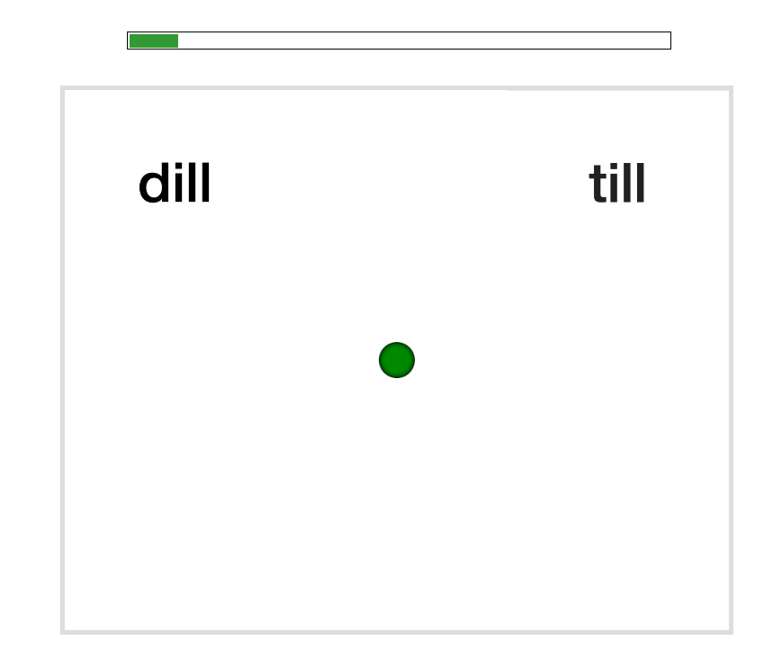

<!-- Do NOT knit this document. It is part of a larger document. Instead knit the main document (my-apa-formatted-article) 
     If you want to separate the SI from the rest of the paper, we recommend you do so AFTER knitting them into a single PDF. 
     This will make sure that all references to sections, figures, tables, etc. are working as intended. You can easily separate 
     the PDF into two parts, using e.g., Acrobat PDF viewer. //-->
     
# Supplementary information {-}
\setcounter{section}{0}

Both the main text and these supplementary information (SI) are derived from the same R markdown document available via [OSF](). It is best viewed using Acrobat Reader. Some links and animations might not work in other PDF viewers. 

# Required software {#sec:SI-software}
The document was compiled using \texttt{knitr} [@xie2021] in RStudio with R:

```{r} 
version
```

You will also need to download the IPA font [SIL Doulos](https://software.sil.org/doulos/download/) and a Latex environment like (e.g., [MacTex](https://tug.org/mactex/mactex-download.html) or the R library \texttt{tinytex}). 

We used the following R packages to create this document: `r cite_r("latex-stuff/r-references.bib", withhold = T, pkgs = c("MVBeliefUpdatr"))`. If opened in RStudio, the top of the R markdown document should alert you to any libraries you will need to download, if you have not already installed them. The full session information is provided at the end of this document.

# Overview

## Overview of data organisation

# Stimuli generation for perception experiments


## Recording of audio stimuli
An L1-US English female talker originally from New Hampshire was recruited for recording of the stimuli. She was recorded at the Human Language Processing lab at the Brain & Cognitive Sciences Department, University of Rochester with the help of research assistant (also an L1-US English speaker). She was 23 years old at the time of recording and was judged by the research assistant to have a generic US American accent known as "general American". 

Four /d-t/ minimal pairs (dill-till, din-tin, dim-tim, dip-tip) were recorded together with 20 filler words. The words were  displayed on a laptop placed in front of the speaker. The word pairs were divided into two lists and presented as separate recording blocks. Each list was repeated 5 times (70 words per list). The target minimal pair words never appeared in the same block. Word presentation was delivered with PsychoPy [@Peirce2019]and the presentation was controlled by the researcher from a computer located outside the recording room. The order of each block was randomised such that target words never appeared consecutively. The talker was instructed to speak clearly and confidently, and to maintain a consistent distance from the microphone. 

## Annotation of audio stimuli
Durational, measurements of voicing lead, VOT, and vowel were taken in addition to the mean F0 of the first 25% of the vowel duration. Annotations were made with a combination of listening to the audio file and inspection of the waveform and spectrogram. The annotation boundaries were made according to the following principles:

* negative VOT (voicing during closure) -- the start was marked as the first sign of periodicity in the waveform before closure release. The end was marked at the point of closure release

* VOT -- start: the point of closure release. End: the beginning of clearly defined periodicity in the waveform and at the appearance of low frequency energy in the spectrogram.

* Vowel -- start: the beginning of clearly defined periodicity in the waveform and at the appearance of low frequency energy in the spectrogram. End: if before a stop, when periodicity becomes irregular or at closure onset; if before a lateral, when formant transition approaches steady state; if before a nasal, when formants show a step-wise shift and when intensity shows a steep decline. 

* F0 at vowel onset -- the average pitch measurement estimated over the first quarter of the total vowel duration.

[INSERT EXAMPLE IMAGES]

## Synthesis of audio stimuli
The stimuli was created using the "progressive cutback and replacement method" by [@winn2020manipulation] implemented in Praat [@boersma2022praat]. This automates and greatly simplifies the process for generating highly natural sounding stimuli. Users of the script need only specify certain parameters to produce desired stimuli. Stimuli with negative VOT values were created separately from stimuli with positive VOT. This was because the script cannot automate the creation of tokens with negative VOT values that were natural sounding ^[it can however, produce prevoicing sufficiently well for demonstration purposes, see video demo at https://www.youtube.com/watch?v=-QaQCsyKQyo]. As such, the negative VOT stimuli were created by prepending pre-voicing generated from naturally produced tokens (described below).

## Positive VOT tokens
For each minimal pair a continuum of 31 tokens was generated between 0ms and 150ms with a step-size of 5ms. A token of the voiced category from each pair was selected to be the base sound file to make the continuum. All four minimal pair continua had an identical aspiration sound which was excised from one of the voiceless tokens produced by the talker. The rate of increase for aspiration intensity was kept at the default settings of the script. 
While the main manipulation of the recordings was done on VOT we set the fundamental frequency (F0) to covary with VOT according to the natural correlation exhibited by our talker. The F0 values were predicted by regressing the talker's F0 measurements on VOT. Target F0 values for each token were then generated by setting the predicted F0 values of the end-point VOT tokens (0ms and 150ms) in the Praat script.   
The vowel cut-back ratio was set at 0.33 which translates into a third of a ms vowel reduction for every 1ms of VOT. This ratio followed the estimated vowel duration-VOT trade-off for dip-tip minimal pair tokens reported in @allenMiller

## Negative VOT tokens
Pre-voicing in 5ms increments were generated from a a clear pre-voicing waveform excised from a voiced token produced by the talker. To achieve a desired duration a duration factor is first computed and then converted with the "lengthen (overlap-add)" function in Praat. For example, if the desired amount of prevoicing was 50ms then the duration factor would be 50ms/length of the original pre-voicing sample. Each pre-voicing step is then prepended to a token with 0ms VOT. Each of these 0ms tokens was generated with @winn2020manipulation Praat script by manually entering the expected F0 value for a given pre-voicing duration based on the predictions of the linear model.

All the synthesised stimuli were subsequently annotated for pre-voicing, VOT, vowel duration and F0 at the first 5ms from vowel onset. This F0 measurement was made in order to align the data with the production database that we use for ideal observer analysis. Each item's F0 in relation to VOT is plotted in figure X. 

```{r}
# annotation information of synthesised stimuli
files <- list.files(path = "../materials/stimuli_AE/annotation_files/", pattern = "^d.*_stimuli_f0_measured.csv")

file_list <- seq(1:length(files))

d <- map(file_list, ~ read_csv(file = str_c("../materials/stimuli_AE/annotation_files/", files[[.x]]))) 
d %<>% bind_rows() %>% 
  mutate(temp = filename) %>% 
  separate(temp, c("word", "VOT", "target_f0"), sep = "_") %>% 
  mutate(VOT = as.numeric(gsub("VOT(.*)$", "\\1", VOT))) %>% 
  arrange(filename, word, vowel, VOT, target_f0, f0_5ms_into_vowel, f0_10ms_into_vowel)

#write_csv(d, "../../materials/stimuli_AE/annotation_files/AE_stimuli_synthesised_actualf0.csv")

# using lm() to obtain general linear function
lm(f0_5ms_into_vowel ~ 1 + VOT, data = d)

d %>% 
  ggplot(aes(x = VOT, y = f0_5ms_into_vowel, colour = word)) +
  geom_point(alpha = .4, size = 2) + 
  scale_x_continuous(breaks = seq(-100, 150, 10)) +
  scale_y_continuous(breaks = seq(240, 252, 0.5)) +
  geom_abline(intercept = 245.46968, slope = 0.03827, alpha = .5) +
  scale_colour_discrete("Minimal pair")
```


### Making exposure conditions


# Web-based experiment design procedure

## Norming experiment: Listener's expectations prior to informative exposure
The norming experiment investigates native (L1) US English listeners' categorization of word-initial stop voicing by an unfamiliar female L1 US English talker, prior to more informative exposure. Specifically, listeners heard isolated recordings from a /d/-/t/ continuum, and had to respond which word they  heard (e.g., "din" or "tin"). The recordings varied in voice onset time (VOT), the primary phonetic cue to word-initial stop voicing in L1 US English, as well as correlated secondary cues (f0 and rhyme duration). Critically, exposure was relatively uninformative about the talker's use of the phonetic cues in that all phonetic realizations occurred equally often. 

The primary goal of norming was methodological. We used the norming experiment to test basic assumptions about the paradigm and stimuli we employ in this study. We obtain estimates of the category boundary between /d/ and /t/ *for the specific stimuli used in Experiment 2*, as perceived by *the type of listeners we seek to recruit for the main experiment*. We also test whether prolonged testing across the phonetic continuum changes listeners' categorization behavior. Previous work has found that prolonged testing on uniform distributions can reduce the effects of previous exposure [e.g., @mitterer2011; @liu-jaeger2018], at least in listeners of the age group we recruit from [@scharenborg2013comparing]. However, these studies employed only a small number of 5-7 perceptually highly ambiguous stimuli, each repeated many times. In the norming experiment, we employ a much larger set of stimuli that span the entire continuum from very clear /d/s to very clear /t/s, each presented only twice. If prolonged testing changes listeners' responses, this has to be taken into account in the design of the main.


## Methods 
### Participants
Participants were recruited over Amazon's Mechanical Turk platform, and paid $2.50 each (for a targeted remuneration of \$6/hour). The experiment was only visible to Mechanical Turk participants who (1) had an IP address in the United States, (2) had an approval rating of 95% based on at least 50 previous assignments, and (3) had not previously participated in any experiment on stop voicing from our lab. 

24 L1 US English listeners (female = 9; mean age = 36.2 years; SD age = 9.2 years) completed the experiment. To be eligible, participants had to confirm that they (1) spent at least the first 10 years of their life in the US speaking only English, (2) were in a quiet place, and (3) wore in-ear or over-the-ears headphones that cost at least \$15. 

### Materials 
The VOT continua ranged from -100ms VOT to +130ms VOT in 5ms steps. Experiment 1 employs 24 of these steps (-100, -50, -10, 5  `r paste0(seq(15, 90, 5), collapse = ", ")`, `r paste0(seq(100, 130, 10), collapse = ", ")`). VOT tokens in the lower and upper ends were distributed over larger increments because stimuli in those ranges were expected to elicit floor and ceiling effects, respectively. 

We further set the F0 at vowel onset to follow the speaker's natural correlation which was estimated through a linear regression analysis of all the recorded speech tokens. We did this so that we could determine the approximate corresponding f0 values at each VOT value along the continua as predicted by this talker's VOT. The duration of the vowel was set to follow the natural trade-off relation with VOT reported in @allen1999effects. This approach closely resembles that taken in @theodore2019distributional, and resulted in continuum steps that sound highly natural [unlike the robotic-sounding stimuli employed in @clayards2008perception; @kleinschmidt2016you]. All stimuli are available as part of the OSF repository for this article.

In addition to the critical minimal pair continua we also recorded three words that did not did not contain any stop consonant sounds ("flare", "share", and "rare"). These word recordings were used as catch trials. Stimulus intensity was set to 70 dB sound pressure level for all recordings. 

### Procedure
The code for the experiment is available as part of the OSF repository for this article. A live version is available at (https://www.hlp.rochester.edu//experiments/DLVOT/series-A/experiment-A.html?list_test=NORM-A-forward-test). The first page of the experiment informed participants of their rights and the requirements for the experiment: that they had to be native listeners of English, wear headphones for the entire duration of the experiment, and be in a quiet room without distractions. Participants had to pass a headphone test, and were asked to keep the volume unchanged throughout the experiment. Participants could only advance to the start of the experiment by acknowledging each requirement and consenting to the guidelines of the Research Subjects Review Board of the University of Rochester. 

On the next page, participants were informed about the task for the remainder of the experiment. They were informed that they would hear a female talker speak a single word on each trial, and had to select which word they heard. Participants were instructed to listen carefully and answer as quickly and as accurately as possible. They were also alerted to the fact that the recordings were subtly different and therefore may sound repetitive. This was done to encourage their full attention.

Each trial started with a dark-shaded green fixation dot being displayed. At 500ms from trial onset, two minimal pair words appeared on the screen, as shown in Figure \@ref(fig:exp1-example-trial). At 1000ms from trial onset, the fixation dot would turn bright green and an audio recording from the matching minimal pair continuum started playing. Participants were required to click on the word they heard. For each participant, /d/-initial words were either always displayed on the left side or always displayed on the right side. Across participants, this ordering was counter-balanced. After participants clicked on the word, the next trial began.

```{r exp1-example-trial, fig.cap="Example trial display. The words were displayed 500ms after trial onset and the audio recording of the word was played 1000ms after trial onset"}

```

Participants heard 192 target trials (four minimal pair continua, each with 24 VOT steps, each heard twice). In addition, participants heard 12 catch trials. On catch trials, participant saw two written catch stimuli on the screen (e.g., "flare" and "rare"), and heard one of them (e.g. "rare"). Since these recordings were easily distinguishable, they served as a check on participant attention throughout the experiment. 

The order of trials was randomized for each participant with the only constraint that no stimulus was repeated before each stimulus had been heard at least once. Catch trials were distributed randomly throughout the experiment with the constraint that no more than two catch trials would occur in a row. Participants were given the opportunity to take breaks after every 60 trials. Participants took an average of 12 minutes (SD = 4.8) to complete the 204 trials, after which they answered a short survey about the experiment. 

```{r, echo=FALSE, warning=FALSE}
# load formatted dataframe from experiment 1
d.test <- read_csv("../data/d.test.Exp1.csv", show_col_types = F)

# load f0-5ms-into-vowel measurements of stimuli
d.f0.5ms <- 
  read_csv("../data/AEDLVOT_stimuli_f0_5ms.csv", show_col_types = F) %>% 
  select(filename, VOT, f0_5ms_into_vowel) %>% 
  rename(Item.VOT = VOT,
         Item.f0_5ms = f0_5ms_into_vowel,
         Item.Filename = filename) %>% 
  mutate(Item.Filename = paste0(Item.Filename, ".wav"))

d.test %<>% 
ungroup() %>%
  left_join(d.f0.5ms, by = c("Item.Filename", "Item.VOT")) %>% 
              mutate(Item.Mel_f0_5ms = normMel(Item.f0_5ms))

# mark catch trials rows and check correct
d.test %<>% 
  mutate(
    Is.CatchTrial = ifelse(Item.ExpectedResponse %in% c("flare", "rare", "share"), TRUE, FALSE),
    CatchTrial.Correct = ifelse(Is.CatchTrial == TRUE & Item.MinimalPair == Response, TRUE, FALSE),
    CatchTrial.Correct = ifelse(Is.CatchTrial == FALSE, NA, CatchTrial.Correct)) %>% 
  group_by(ParticipantID) %>% 
  mutate(Excluded.due.to.CatchTrial = ifelse(sum(CatchTrial.Correct, na.rm = TRUE) < 10, TRUE, FALSE))

# get the rows removed due to catch trial performance
excluded.data.due.to.catch <- 
  d.test %>% 
  group_by(ParticipantID) %>%
  filter(Excluded.due.to.CatchTrial == TRUE)

# set RT exclusion criteria and create excluded columns
d.test %<>%
  group_by(ParticipantID) %>%
  filter(Excluded.due.to.CatchTrial == FALSE) %>% 
  mutate(Response.log_RT = log10(ifelse(Response.RT <= 0, NA_real_, Response.RT)),
         # scale the log RTs
         Response.log_RT.scaled = scale(Response.log_RT), 
         # this gives each subject's mean log_RT
         Response.log_RT.mean = mean(Response.log_RT, na.rm = T)) %>% 
  ungroup() %>% 
  mutate(Excluded.participant.due.to.mean.RT = ifelse(abs(scale(Response.log_RT.mean)) > 3, TRUE, FALSE))
         # Get participants whose means are more than 3x sd of mean of participant means. Mean of means is the same as mean of all rows because each participant has the same number of rows.
         

excluded.participants.due.to.mean.RT <- 
  d.test %>% 
  filter(Excluded.participant.due.to.mean.RT == TRUE)

d.test %<>% 
  filter(Excluded.due.to.CatchTrial == FALSE & Excluded.participant.due.to.mean.RT == FALSE) %>% 
  group_by(ParticipantID) %>% 
  mutate(Excluded.trial.due.to.RT = ifelse(abs(Response.log_RT.scaled) > 3, TRUE, FALSE))
  
# get the rows removed due to RT
excluded.data.due.to.RT <- 
  d.test %>% 
  filter(Excluded.participant.due.to.mean.RT == TRUE | Excluded.trial.due.to.RT == TRUE) 

# get the proportion of rows excluded from analysis
proportion.excluded <- (nrow(excluded.data.due.to.RT)) / (nrow(d.test))

# make a dataframe after exclusion to be used for analysis
d.test.excluded <- 
  d.test %>% 
  filter(
    Is.CatchTrial == FALSE, 
    Excluded.due.to.CatchTrial == FALSE, 
    Excluded.trial.due.to.RT == FALSE) %>% 
  mutate(Response.ProportionVoiceless = ifelse(Response.Voicing == "voiceless", 1, 0))
```


### Exclusions
We excluded from analysis participants who committed more than 2 errors out of the 12 catch trials (<83% accuracy, N = 3), participants with an average reaction time (RT) more than three standard deviations from the mean of the by-participant means (N = 0), and participants who reported not to have used headphones (N = 0) or not to be native (L1) speakers of US English (N = 0). For the remaining participants, trials that were more than three SDs from the participant's mean RT were excluded from analysis (`r proportion.excluded * 100 `%). Finally, we excluded participants (N = 0) who had less than 50% data remaining after these exclusions. 

### Analysis approach
The goal of our behavioral analyses was to address three methodological questions that are of relevance to Experiment 2: (1) whether our stimuli resulted in 'reasonable' categorisation functions, (2) whether these functions differed between the four minimal pair items, and (3) whether participants' categorisation functions changed throughout the 192 test trials.

To address these questions, we fit a single Bayesian mixed-effects psychometric model to participants' categorization responses on critical trials [e.g., @prins2011]. This model is essentially an extension of mixed-effects logistic regression that also takes into account attentional lapses. A failure to do so---while commonplace in research on speech perception [incl. our own work, but see @clayards2008; @kleinschmidt2016you]---can lead to biased estimates of categorization boundaries [e.g., @wichmann2001psychometric]. The mixed-effects psychometric model describes the probability of "t"-responses as a weighted mixture of a lapsing-model and a perceptual model. The lapsing model is a mixed-effects logistic regression [@jaeger2008categorical] that predicts participant responses that are made independent of the stimulus---for example, responses that result from attentional lapses. These responses are independent of the stimulus, and depend only on participants' response bias. The perceptual model is a mixed-effects logistic regression that predicts all other responses, and captures stimulus-dependent aspects of participants' responses. The relative weight of the two models is determined by the lapse rate, which is described by a third mixed-effects logistic regression.

The *lapsing model* only contained an intercept (the response bias in log-odds) and by-participant random intercepts. Similarly, the *model for the lapse rate* only had an intercept (the lapse rate) and by-participants random intercepts. No by-item random effects were included for the lapse rate nor lapsing model since these parts of the analysis---by definition---describe stimulus-*in*dependent behavior. The *perceptual model* included an intercept and VOT, as well as the full random effect structure by participants and items (the four minimal pair continua), including random intercepts and random slopes by participant and minimal pair. We did not model the random effects of trial to reduce model complexity. This potentially makes our analysis of trials in the model anti-conservative. Finally, the models included the covariance between by-participant random effects across the three linear predictors for the lapsing model, lapse rate model, and perceptual model. This allows us to capture whether participants who lapse more often have, for example, different response biases or different sensitivity to VOT (after accounting for lapsing).

We fit the model using the package \texttt{brms} [@R-brms_a] in R [@R; @RStudio]. Following previous work from our lab [@horberg2021rational; @xie2021cross], we used weakly regularizing priors to facilitate model convergence. For fixed effect parameters, we standardized continuous predictors (VOT) by dividing through twice their standard deviation [@gelman2008scaling], and used Student priors centered around zero with a scale of 2.5 units [following @gelman2008weakly] and 3 degrees of freedom. For random effect standard deviations, we used a Cauchy prior with location 0 and scale 2, and for random effect correlations, we used an uninformative LKJ-Correlation prior with its only parameter set to 1, describing a uniform prior over correlation matrices [@Lewandowski2009]. Four chains with 2000 warm-up samples and 2000 posterior samples each were fit. No divergent transitions after warm-up were observed, and all $\hat{R}$ were close to 1.

### Expectations 
Based on previous experiments, we expected a strong positive effect of VOT, with increasing proportions of "t"-responses for increasing VOTs. We did not have clear expectations for the effect of trial other than that responses should become more uniformed (i.e move towards 50-50 "d"/"t"-bias or 0-log-odds) as the experiment progressed [@liu2018inferring] due to the un-informativeness of the stimuli. 
Previous studies with similar paradigms have typically found lapse rates of 0-10% [< -2.2 log-odds, e.g., @clayards2008perception; @kleinschmidt2016you]. 

```{r}
# set the mean and SD values for scaling/unscaling purposes
VOT.mean_exp1 <- mean(d.test.excluded$Item.VOT)
VOT.sd_exp1 <- sd(d.test.excluded$Item.VOT)
Trial.mean <- mean(d.test.excluded$Trial) 
Trial.sd <- sd(d.test.excluded$Trial)
f0.mean_exp1 <- mean(d.test.excluded$Item.Mel_f0_5ms)
f0.sd_exp1 <- sd(d.test.excluded$Item.Mel_f0_5ms)

d.test.excluded %<>%
  mutate(
    sVOT = (Item.VOT - VOT.mean_exp1) / (2 * VOT.sd_exp1),
    sTrial = (Trial - Trial.mean) / (2 * Trial.sd))

# set priors for psychometric model
my_priors <- c(
  prior(student_t(3, 0, 2.5), class = "b", dpar = "mu2"), # prior 
  prior(student_t(3, 0, 2.5), class = "b", dpar = "theta1"), 
  prior(cauchy(0, 2.5), class = "sd"),
  prior(lkj(1), class = "cor")
)

# load (or run) the psychometric model with interaction
fit_mix <- brm(
  bf(
    Response.Voicing == "voiceless" ~ 1,
    mu1 ~ 1 + (1 | g | ParticipantID),
    mu2 ~ 1 + sVOT * sTrial + (1 + sVOT | g | ParticipantID) + (1 + sVOT | h | Item.MinimalPair),
    theta1 ~ 1 + (1 | g | ParticipantID)),
  data = d.test.excluded,
  cores = 4,
  iter = 4000,
  warmup = 2000,
  family = mixture(bernoulli("logit"), bernoulli("logit")),
  control = list(adapt_delta = .99),
  file = "../models/Exp-NORM-lapsing-bias-GLMM")

# get effects of psychometric fit conditioned on VOT interacting with trial
if (file.exists("../models/conditional_effects_VOT_Trial.rds")) {
  psychometric_fit_exp1 <- read_rds("../models/conditional_effects_VOT_Trial.rds")
} else {
  int_conditions <- list(sTrial = sort(unique((d.test.excluded$Trial - Trial.mean)) / (2 * Trial.sd)))
  
  psychometric_fit_exp1 <-
    conditional_effects(
      fit_mix,
      effects = "sVOT:sTrial",
      int_conditions = int_conditions,
      ndraws = 1000,
      plot = F)[[1]]
  
  write_rds(psychometric_fit_exp1, file = "../models/conditional_effects_VOT_Trial.rds")
}

# get the PSE from the fitted categorisation function
PSE.fit_mix <- descale(-(summary(fit_mix)$fixed["mu2_Intercept", 1] / summary(fit_mix)$fixed["mu2_sVOT", 1]), VOT.mean_exp1, VOT.sd_exp1) 

# get posterior samples of intercept and slope, and median qi of the PSEs
post_sample_norm <- fit_mix %>% 
  spread_draws(b_mu2_Intercept, b_mu2_sVOT) %>% 
  mutate(PSE = descale(-(b_mu2_Intercept/b_mu2_sVOT), VOT.mean_exp1, VOT.sd_exp1)) %>% 
  median_qi(PSE)
```


```{r}
# prepare data for predicted categorisation by min pair
newdata <- expand_grid(
  sVOT = (seq(-100, 130, 1) - VOT.mean_exp1) / (2 * VOT.sd_exp1),
  Item.MinimalPair = levels(factor(d.test.excluded$Item.MinimalPair)),
  ParticipantID = levels(factor(d.test.excluded$ParticipantID)),
  sTrial = 0)

# get expectation values for categorisation by min pair through posterior predictions
if (file.exists("../models/categorisation_by_min_pair.rds")) {
  cat_minimalpair <- read_rds("../models/categorisation_by_min_pair.rds")
} else {
  cat_minimalpair <- fit_mix %>%
    epred_draws(
      newdata = newdata,
      ndraws = 1000,
      re_formula = ~ (1 + sVOT | Item.MinimalPair))
  write_rds(cat_minimalpair, file = "../models/categorisation_by_min_pair.rds")
}
```


```{r fitted-categorisation-minimal-pair"}
remove_axes_titles <- theme(axis.title.x = element_blank(),
                            axis.title.y = element_blank())
MinPair_plot <- 
  cat_minimalpair %>% 
  group_by(sVOT, Item.MinimalPair) %>% 
  ggplot(aes(x = descale(sVOT, VOT.mean_exp1, VOT.sd_exp1), 
             y = .epred, colour = Item.MinimalPair)) +
  stat_lineribbon(alpha = .9, .width = 0.95) +
  scale_y_continuous("Fitted proportion of 't'-responses") +
  scale_color_manual("Minimal Pair", breaks = c("dilltill", "dimtim", "dintin", "diptip"),  
                     values = c("#002699", "#0040ff", "#668cff", "#b3c6ff"), 
                     labels = c("dill/till", "dim/tim", "din/tin", "dip/tip")) +
  scale_fill_brewer("CI", palette = "Greys", type = "qual") +
  remove_axes_titles +
  theme(axis.text.y = element_blank(),
        axis.ticks.y = element_blank())
  
```


```{r psychometric-plot, fig.width=3.8, fig.height =2.6, message=FALSE}
p.vot <- 
  psychometric_fit_exp1 %>% 
  group_by(sVOT) %>% 
  summarise(estimate__ = mean(estimate__),
         lower__ = mean(lower__),
         upper__ = mean(upper__)) %>% 
  ggplot(aes(x = descale(sVOT, VOT.mean_exp1, VOT.sd_exp1), 
             y = estimate__)) +
  scale_x_continuous("VOT (ms)", breaks = scales::pretty_breaks(n = 4), limits = c(-100, 130)) +
  scale_y_continuous("Fitted proportion of 't' responses") +
  geom_ribbon(
    aes(ymin = lower__, 
        ymax = upper__), alpha = .08) +
  geom_line(linewidth = 1.5, 
            colour = "#333333",
            alpha = .8) +
  geom_errorbarh(
    data = post_sample_norm %>% 
      mutate(y = .01),
    mapping = aes(xmin = .lower, xmax = .upper, y = y), 
    color = "#333333",
    height = 0,
    alpha = .8,
    size = 1, 
    inherit.aes = F) +
  geom_label(data = post_sample_norm %>% 
      mutate(y = 0.01, PSE = round(PSE)),
    mapping = aes(x = PSE, y = y, label = PSE),
    color = "#333333", 
    size = 1.8,
    label.padding = unit(0.18, "lines"),
    inherit.aes = F) +
  annotate(
    geom = "text",
    x = 75,
    y = 0.01, 
    label = paste(round(post_sample_norm[[2]]), "ms", "-", round(post_sample_norm[[3]]), "ms"),
    size = 2.5,
    colour = "darkgray") +
## transformation of by-participant means into empirical logits
   # stat_summary(
   #  data = d.test.excluded %>% 
   #    group_by(ParticipantID, Item.VOT) %>% 
   #    mutate(Response.ProportionVoiceless = ifelse(Response.Voicing == "voiceless", 1, 0)) %>%
   #    summarise(Response.EmpiricalLogitVoiceless = qlogis((sum(Response.ProportionVoiceless) + .5)/(length(Response.ProportionVoiceless) + 1))), 
   #  mapping = aes(x = Item.VOT, 
   #                y = Response.EmpiricalLogitVoiceless),
   #  geom = "pointrange",
   #  fun.data = function(x){mean_cl_boot(x) %>% mutate(across(c(y, ymin, ymax), ~ plogis(.x)))},
   #  size = .4,
   #  colour = "#c4b7a6",
   #  alpha = .6,
   #  inherit.aes = F) 
  stat_summary(
    data = d.test.excluded %>% 
      group_by(ParticipantID, Item.VOT) %>% 
      mutate(Response.ProportionVoiceless = ifelse(Response.Voicing == "voiceless", 1, 0)) %>%
      summarise(Response.ProportionVoiceless = mean(Response.ProportionVoiceless)), 
    mapping = aes(x = Item.VOT, 
                  y = Response.ProportionVoiceless),
    geom = "pointrange",
    fun.data = "mean_cl_boot",
    size = .4,
    colour = "#c4b7a6",
    alpha = .6,
    inherit.aes = F) +
  labs(x = "VOT (ms)")
```

(ref:fitted-categorisation-plots) Categorisation functions and points of subjective equality (PSE) derived from the Bayesian mixed-effects psychometric model fit to listeners' responses in Experiment 1. The categorization functions include lapse rates and biases. The PSEs correct for lapse rates and lapse biases (i.e., they are the PSEs of the perceptual component of the psychometric model).\protect\footnote{Here and in Experiment 2, lapse biases were close to uniform (.5/.5). For such scenarios, bias-corrected PSEs will be very similar to uncorrected PSEs. This is also evident in Figure \ref{fig:fitted-categorisation-plots}.} **Left:** Effects of VOT, lapse rate, and lapse bias, while marginalizing over trial effects as well as all random effects. Vertical point ranges represent the mean proportion and 95% bootstrapped CIs of participants' "t"-responses at each VOT step. Horizontal point ranges denote the mean and 95% quantile interval of the points of subjective equality (PSE), derived from the 8000 posterior samples of the population parameters. **Right:** The same but showing the fitted categorization functions for each of the four minimal pair continua. Participants' responses are omitted to avoid clutter.   

```{r fitted-categorisation-plots, warning=FALSE, fig.width=6, fig.height = 3.3, fig.cap="(ref:fitted-categorisation-plots)"}
MinPair_plot <- MinPair_plot + labs(x = "VOT (ms)")

xlab <- p.vot$labels$x
p.vot$labels$x <- MinPair_plot$labels$x <- " "

(p.vot | MinPair_plot) + 
  plot_layout(ncol = 2, guides = "collect") &
  theme(legend.position = "top")
```

```{r by-participant-lapse-bias, warning=FALSE, fig.height=2.6, fig.width=6.5}
lapse_participant <- fit_mix %>% spread_draws(r_ParticipantID__theta1[ParticipantID, term], b_theta1_Intercept) %>%
  group_by(ParticipantID) %>%
  mutate(ParticipantID = factor(ParticipantID),
         Participant_lapse = b_theta1_Intercept + r_ParticipantID__theta1,
         estimated_lapse = plogis(Participant_lapse) * 100) %>%
  select(ParticipantID, term, r_ParticipantID__theta1, Participant_lapse, estimated_lapse) %>%
  mode_hdci(estimated_lapse)

bias_participant <- fit_mix %>%
  spread_draws(r_ParticipantID__mu1[ParticipantID, term], b_mu1_Intercept) %>%
  group_by(ParticipantID) %>%
  mutate(ParticipantID = factor(ParticipantID),
         Participant_bias = b_mu1_Intercept + r_ParticipantID__mu1,
         estimated_bias = plogis(Participant_bias) * 100) %>%
  select(ParticipantID, term, r_ParticipantID__mu1, Participant_bias, estimated_bias) %>%
  mode_hdci(estimated_bias)

estimate_minpair <- fit_mix %>% spread_draws(r_Item.MinimalPair__mu2[Item.MinimalPair, term], b_mu2_Intercept, b_mu2_sVOT) %>%
  group_by(Item.MinimalPair) %>%
  mutate(predicted_eff = ifelse(term == "Intercept", r_Item.MinimalPair__mu2 + b_mu2_Intercept, r_Item.MinimalPair__mu2 + b_mu2_sVOT)) %>%
  group_by(Item.MinimalPair, term) %>%
  mode_hdci(predicted_eff) %>%
  pivot_wider(names_from = term,
              values_from = c(predicted_eff, .lower, .upper))
```

The lapse rate was estimated to be on the slightly larger side, but within the expected range 
(`r make_CI(fit_mix, "theta1_Intercept", "theta1_Intercept < 0")`). Maximum a posteriori (MAP) estimates of by-participant lapse rates ranged from XX . Very high lapse rates were estimated for four of the participants with one in particular whose CI indicated exceptionally high uncertainty. These lapse rates might reflect data quality issues with Mechanical Turk that started to emerge over recent years [see @REFS; and, specifically for experiments on speech perception, @cummings2023], and we return to this issue in Experiment 2. 

The response bias were estimated to slightly favor "t"-responses (`r make_CI(fit_mix, "mu1_Intercept", "mu1_Intercept > 0")`), as also visible in Figure \@ref(fig:fitted-categorisation-plots) (left).
Unsurprisingly, the psychometric model suggests high uncertainty about the participant-specific response biases, as it is difficult to reliably estimate participant-specific biases while also accounting for trial and VOT effects (range of by-participant MAP estimates: XX). For all but four participants, the 95% CI includes the hypothesis that responses were unbiased. Of the remaining four participants, three were biased towards "t"-responses and one was biased toward "d"-responses.

There was no convincing evidence of a main effect of trial ($\hat{\beta} =$ `r get_CI(fit_mix, "mu2_sTrial", "mu2_sTrial < 0")`). Given the slight overall bias towards "t"-responses, the direction of this effect indicates that participants converged towards a 50/50 bias as the test phase proceeded. This is also evident in Figure \@ref(fig:fitted-categorisation-plots) (right). In contrast, there was clear evidence for a positive main effect of VOT on the proportion of "t"-responses ($\hat{\beta} =$ `r get_CI(fit_mix, "mu2_sVOT", "mu2_sVOT > 0")`). The effect of VOT was consistent across all minimal pair words as evident from the slopes of the fitted lines by minimal pair \@ref(fig:fitted-categorisation-plots) (left). MAP estimates of by minimal pair slopes ranged from . The by minimal-pair intercepts were more varied (MAP estimates: ) with one of the pairs, dim/tim having a slightly lower intercept resulting in fewer 't'-responses on average. In all, this justifies our assumptions that word pair would not have a substantial effect on categorisation behaviour. From the parameter estimates of the overall fit we obtained the category boundary from the point of subjective equality (PSE) `r( descale(-(summary(fit_mix)$fixed["mu2_Intercept", 1] / summary(fit_mix)$fixed["mu2_sVOT", 1]), VOT.mean_exp1, VOT.sd_exp1) ms)` which we use for the design of Experiment 2.

Finally to accomplish the first goal of experiment 1, we look at the interaction between VOT and trial. There was weak evidence that the effect of VOT decreased across trials ($\hat{\beta} =$ `r get_CI(fit_mix, "mu2_sVOT:sTrial", "mu2_sVOT:sTrial < 0")`). The direction of this change---towards more shallow VOT slopes as the experiment progressed---makes sense since the test stimuli were not informative about the talker's pronunciation. Similar changes throughout prolonged testing have been reported in previous work. [@liu-jaeger2018; @liu-jaeger2019; @REFS].

Overall, there was little evidence that participants substantially changed their categorisation behaviour as the experiment progressed. Still, to err on the cautious side, Experiment 2 employs shorter test phases.


### Regression analysis - model selection

```{r comparing-regression-models, fig.height=3, fig.width=5.5, fig.cap="Expected effect of VOT interacting with trial on categorisation from model: 1 + (sVOT + sFO) * sTrial shown as red dashed line with pink shaded CI. Grey line and shaded area represents effects of VOT interacting with trial from model: 1 + sVOT * sTrial"}
# run an alternative model with f0 as a predictor
# get f0 mean and sd for scaling
f0.mean_exp1 <- mean(d.test.excluded$Item.Mel_f0_5ms)
f0.sd_exp1 <- sd(d.test.excluded$Item.Mel_f0_5ms)
d.test.excluded %<>% 
  mutate(sF0 = (Item.Mel_f0_5ms - f0.mean_exp1)/(2 * f0.sd_exp1))

# specify new model formula (priors will be same as previous model without f0)
fit_mix_f0 <- brm(
  bf(
    Response.Voicing == "voiceless" ~ 1,
    mu1 ~ 1 + (1 | g | ParticipantID),
    mu2 ~ 1 + (sVOT + sF0) * sTrial + (1 + (sVOT + sF0) * sTrial | g | ParticipantID) + (1 + (sVOT + sF0) * sTrial | h | Item.MinimalPair),
    theta1 ~ 1 + (1 | g | ParticipantID)),
  data = d.test.excluded,
  cores = 4,
  iter = 4000,
  warmup = 2000,
  family = mixture(bernoulli("logit"), bernoulli("logit")),
  control = list(adapt_delta = .99),
  file = "../models/Exp-NORM-lapsing-Trial-F0.rds")

if (file.exists("../models/conditional_effects_fit_mix_f0.csv")){
  fit_mix_f0_data <- read_rds("../models/conditional_effects_fit_mix_f0.csv")
} else {
  int_conditions <- list(sTrial = sort(unique((d.test.excluded$Trial - Trial.mean)) / (2 * Trial.sd)))
  
  fit_mix_f0_data <- conditional_effects(
    fit_mix_f0, 
    effects = "sVOT:sTrial", 
    int_conditions = int_conditions,
    ndraws = 1000,
    plot = F)[[1]] # by default this does not include any group level effects
  
  write_rds(fit_mix_f0_data, "../models/conditional_effects_fit_mix_f0.rds")
}


# plotting conditional effects of VOT from the 2 models side-by-side
psychometric_fit_exp1 %>% 
  group_by(sVOT) %>% 
  summarise(estimate__ = mean(estimate__),
            lower__ = mean(lower__),
            upper__ = mean(upper__)) %>% mutate(model = "1 + sVOT  * sTrial") %>% 
     ggplot(aes(x = descale(sVOT, VOT.mean_exp1, VOT.sd_exp1), 
             y = estimate__, fill = model)) + 
    geom_ribbon(
    data = fit_mix_f0_data %>% 
      group_by(sVOT) %>% 
      summarise(estimate__ = mean(estimate__),
            lower__ = mean(lower__),
            upper__ = mean(upper__)), 
    mapping = aes(
      x = descale(sVOT, VOT.mean_exp1, VOT.sd_exp1),
      ymin = lower__, 
      ymax = upper__),
    fill = "red",
    alpha = 0.05,
    inherit.aes = F) +
  geom_ribbon(aes(ymin = lower__, ymax = upper__),
              fill = "#333333",
              alpha = .1,
              show.legend = F) +
  geom_line(linewidth = 1.5, 
            linetype = "solid",
            colour = "#333333",
            alpha = .2,
            show.legend = F) +
    geom_line(
      data = fit_mix_f0_data %>% 
      group_by(sVOT) %>% 
      summarise(estimate__ = mean(estimate__),
            lower__ = mean(lower__),
            upper__ = mean(upper__)) %>% mutate(model = "with F0"), 
      mapping = aes(x = descale(sVOT, VOT.mean_exp1, VOT.sd_exp1), 
             y = estimate__, fill = model),
      linetype = "dashed",
      colour = "red",
      alpha = .5,
      linewidth = 1.5,
      show.legend = T,
      inherit.aes = F) + 
  scale_x_continuous("VOT (ms)", limits = c(-100, 130)) +
  scale_y_continuous("Fitted proportion of 't' responses") +
  scale_fill_manual("Model", values = c("1 + sVOT  * sTrial" = "#333333", "with F0" = "red"), labels = c("sVOT  * sTrial", "sVOT  * sTrial * F0")) 
```


## Experiment 2
### Making exposure conditions
### Exclusions analysis
- reaction time plots
- catch trial performance plots
### Regression analysis - model selection

```{r catch-trial-performance, fig.height=4, fig.width=6}
d.exposure_test %>% 
  group_by(ParticipantID) %>% 
  summarise(No.CatchTrial.Correct = sum(CatchTrial.Correct, na.rm = T)) %>%
  ggplot(aes(x = No.CatchTrial.Correct)) +
  geom_bar(width = .6) +
  scale_x_continuous("Number of correct catch trials", breaks = seq(0, 18, 1)) +
  scale_y_continuous("Number of participants") 
```


-labelled trial performance plots
```{r labeled-trial-performance-group, fig.width=6, fig.height=4, message=F}
p.labelled <- d.exposure_test %>% 
  filter(Phase == "exposure") %>% 
  group_by(ParticipantID, Condition.Exposure) %>% 
  summarise(LabeledTrial.Correct = sum(LabeledTrial.Correct, na.rm = TRUE)) %>% 
  group_by(Condition.Exposure, LabeledTrial.Correct) %>% 
  summarise(freq = n()) %>% 
  ggplot(aes(x = LabeledTrial.Correct, y = freq, fill = Condition.Exposure)) +
  geom_bar(stat = "identity", position = position_dodge2(width = .5, preserve = "single"), width = .5) +
  geom_text(aes(label = freq), position = position_dodge(width = .5), vjust = -.5) +
  scale_colour_manual("Exposure condition", 
                      aesthetics = c("colour", "fill"), 
                      breaks = c("Shift0", "Shift10", "Shift40"), 
                      values = c("#cc0000", "#12D432","#0481F3")) +
  scale_x_continuous("Total labelled trials correct") +
  scale_y_continuous("No. of participants", breaks  = seq(0, 115, 5)) +
  theme(legend.position = "none") 
```


```{r labeled-trial-performance, fig.width=6, fig.height=4, message=F}
p.labelled.group <- d.exposure_test %>% 
  filter(Phase == "exposure") %>% 
  group_by(ParticipantID, Condition.Exposure, Block) %>% 
  summarise(LabeledTrial.Correct = sum(LabeledTrial.Correct, na.rm = TRUE)) %>% 
  ggplot(aes(x = LabeledTrial.Correct, fill = Condition.Exposure)) +
  geom_bar(position = position_dodge(width = .5, preserve = "single"), width = .5) +
  scale_colour_manual("Exposure condition", 
                      aesthetics = c("colour", "fill"), 
                      breaks = c("Shift0", "Shift10", "Shift40"), 
                      values = c("#cc0000", "#12D432","#0481F3")) +
  scale_x_continuous("Total labelled trials correct") +
  theme(legend.position = "top") +
  facet_grid(Condition.Exposure ~ Block) 

p.labelled + p.labelled.group + plot_layout(guides = "collect") & theme(legend.position = "top")
```


```{r, message=FALSE, fig.width=6, fig.height=5}
d.exposure_test %>% 
  filter(Is.CatchTrial == FALSE & Phase == "exposure") %>% 
  mutate(Item.Labeled = factor(ifelse(Item.Labeled == TRUE, "labeled", "unlabeled"))) %>% 
  summarise(Condition.Exposure, Block, Item.Labeled, Response.Correct) %>% 
  ggplot(aes(x = Response.Correct, fill = Item.Labeled)) +
  geom_bar(position = position_dodge2(width = .5, preserve = "single"), width = .5) +
  scale_x_discrete("Response", labels = c("incorrect", "correct")) +
  scale_colour_manual("Labelling", aesthetics = c("colour", "fill"), breaks = c("labeled", "unlabeled"), values = c("#f6546a", "#00ced1")) +
  theme(legend.position = "top") +
  facet_grid(Condition.Exposure ~ Block) 
```
```{r, message=FALSE, fig.width=6, fig.height=5}
d.test_exposure_for_analysis %>% 
  filter(Is.CatchTrial == FALSE & Phase == "exposure") %>% 
  mutate(Item.Labeled = factor(ifelse(Item.Labeled == TRUE, "labeled", "unlabeled"))) %>% 
  summarise(Condition.Exposure, Block, Item.Labeled, Response.Correct) %>% 
  ggplot(aes(x = Response.Correct, fill = Item.Labeled)) +
  geom_bar(position = position_dodge2(width = .5, preserve = "single"), width = .5) +
  scale_x_discrete("Response", labels = c("incorrect", "correct")) +
  scale_colour_manual("Labelling", aesthetics = c("colour", "fill"), breaks = c("labeled", "unlabeled"), values = c("#f6546a", "#00ced1")) +
  theme(legend.position = "top") +
  facet_grid(Condition.Exposure ~ Block) 
```

```{r fig,width=8, fig.height=5, fig.width=6}
d.exposure_test %>%
  group_by(ParticipantID, Condition.Exposure, Block) %>%
  filter(Is.CatchTrial == FALSE) %>%
  mutate(Response.log_RT = log10(Response.RT)) %>%
  summarise_at("Response.log_RT", .funs = list("mean" = mean, "sd" = sd)) %>%
  ggplot(aes(x = mean, y = sd, label = ParticipantID)) +
  geom_text(aes(colour = Condition.Exposure), alpha = .5) +
  geom_rug(aes(colour = Condition.Exposure), alpha = .5) +
  scale_x_continuous("mean log-RT (log10 of msec)") +
  scale_y_continuous("SD of log-RT") +
  scale_color_manual("Exposure condition", 
                      aesthetics = c("colour", "fill"), 
                      breaks = c("Shift0", "Shift10", "Shift40"), 
                      values = c("#cc0000", "#12D432","#0481F3")) +
  theme(legend.position = "top") +
  facet_wrap( ~ Block )
```


```{r, fig.width=8, fig.height=3}
d.exposure_test %>%
  filter(
    Is.CatchTrial == FALSE &
    Exclude_participant.due_to_catch_trials == FALSE &
    Exclude_participant.due_to_labeled_trials == FALSE &
    Exclude_participant.due_to_VOT_slope == FALSE) %>% 
  group_by(ParticipantID, Block) %>%
  mutate(
    Response.log_RT = log10(ifelse(Response.RT <= 0, NA_real_, Response.RT)),
    Response.log_RT.scaled = scale(Response.log_RT), # deducts each value with subject's own mean, divide by own SD
    Response.log_RT.mean = mean(Response.log_RT, na.rm = T)) %>% 
  ungroup() %>% 
  mutate(across(c(ParticipantID, Condition.Exposure, Block), factor)) %>%
  group_by(ParticipantID, Condition.Exposure,Block, Trial) %>% 
  summarise(Response.log_RT) %>% 
  ggplot(aes(x = Trial, y = Response.log_RT, colour = ParticipantID, group = Condition.Exposure)) +
  geom_path(aes(group = ParticipantID), alpha = .3) +
  scale_x_continuous("Trial", breaks = c(12, 24, 36, 48)) +
  scale_y_continuous("mean log-RT (log10 of msec)") +
  facet_grid(Condition.Exposure ~ Block, scales = "free_x", space = "free_x") +
  theme(legend.position = "none")
```


```{r, fig.width=8, fig.height=3}
d.exposure_test %>% 
  group_by(Trial, Condition.Exposure, Block) %>%
  mutate(Response.log_RT = log10(Response.RT)) %>%
  summarise_at("Response.log_RT", .funs = list("mean" = mean, "sd" = sd)) %>% 
  ggplot(aes(x = Trial, y = mean)) +
  geom_ribbon(aes(ymin = mean - 2*sd, ymax = mean + 2*sd), colour = "lightgrey", alpha = .1) +
  geom_line(aes(group = Condition.Exposure, color = Condition.Exposure), size = 1) +
  scale_x_continuous("Trial", breaks = c(12, 24, 36, 48)) +
  scale_y_continuous("mean log-RT (log10 of msec)") +
  coord_trans(y = "log10") +
      scale_color_manual("Exposure condition", 
                      aesthetics = c("colour", "fill"), 
                      breaks = c("Shift0", "Shift10", "Shift40"), 
                      values = c("#cc0000", "#12D432","#0481F3")) +
  facet_grid(Condition.Exposure~ Block, scales = "free_x", space = "free_x") +
  theme(legend.position = "top")
```


## Ideal observer training
We train the IOs on cue distributions extracted from an annotated database of XX L1 US-English talkers' productions (@chodroff2017structure) of word initial stops. We apply Bayes' theorem to derive the IOs' posterior probability of categorising the test stimuli as "t". This is defined as the product of the likelihood of the cue under the hypothesis that the talker produced "t", and the prior probability of that cue. By using IOs trained solely on production data to predict categorization behaviour we avoid additional computational degrees of freedom and limit the risk of overfitting the model to the data thus reducing bias. 

We filtered the database to /d/s and /t/s which gave 92 talkers (4x male and 4x female), each with a minimum of 25 tokens. We then fit ideal observers to each talker under different hypotheses of distributional learning [and evaluated their respective goodness-of-fit to the human data]. In total we fit x IOs to represent the different hypotheses about listeners' implicit knowledge -- models grouped by sex, grouped by sex and   Predictions of the IO were obtained using talker-normalized category statistics for /d/ and /t/ from [@Kurumada_Xie_Jaeger_2022] based on data from [@chodroff2017], perceptual noise estimates for VOT from [@kronrod2016unified], and a lapse rate identical to the psychometric model estimate. 


```{r, fig.cap="visualising difference between uncentered and centered exposure fit (dashed line) in experiment 1.", fig.width=6, fig.height=4.5}
psychometric_fit_exp1 %>% 
  group_by(sVOT) %>% 
  summarise(
    lower__ = quantile(lower__, probs = .025),
    median = quantile(estimate__, probs = .5),
    upper__ = quantile(upper__, probs = .975),
    estimate__ = quantile(estimate__, probs = .5)) %>% 
    mutate(Item.VOT = descale(sVOT, VOT.mean_exp1, VOT.sd_exp1)) %>% 
  ggplot(aes(x = Item.VOT, y = estimate__)) +
  geom_line(colour = "grey", linewidth = 1.5) +
  geom_line(data = centered_exposure %>% 
  group_by(sVOT) %>% 
  summarise(estimate__ = mean(.epred),
         lower__ = mean(lower__),
         upper__ = mean(upper__)) %>% 
    mutate(Item.VOT = descale(sVOT, VOT.mean_exp1, VOT.sd_exp1)),
  mapping = aes(x = Item.VOT, y = estimate__), 
  linetype = 2,
  linewidth = 1.5,
  inherit.aes = F)
```

# Session Info

```{r session_info, echo=FALSE, results='markup'}
devtools::session_info()
```

